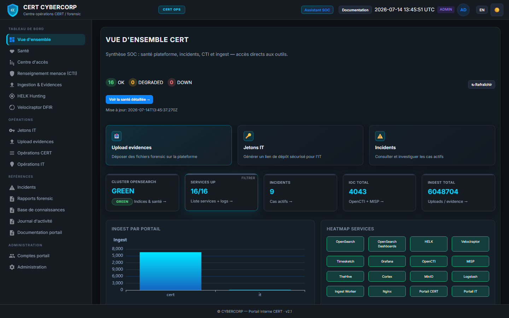
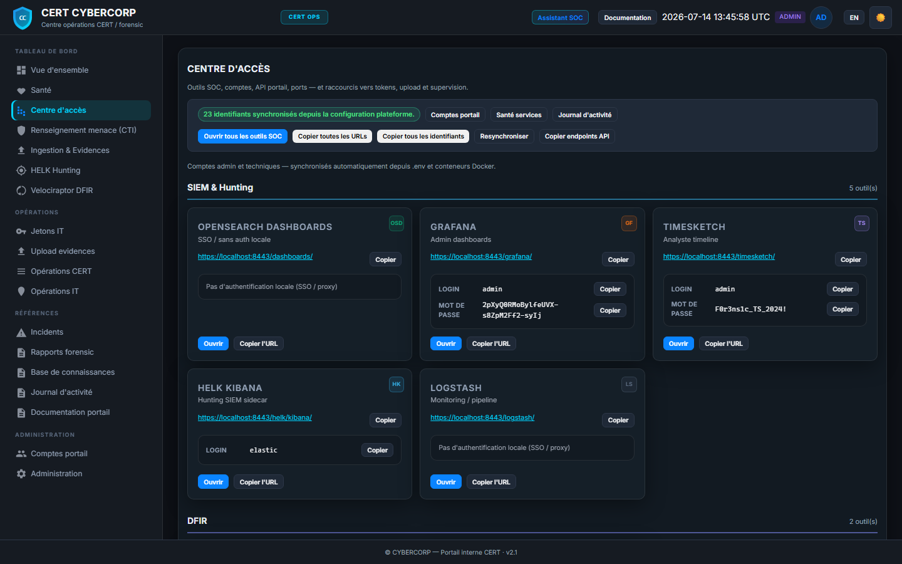
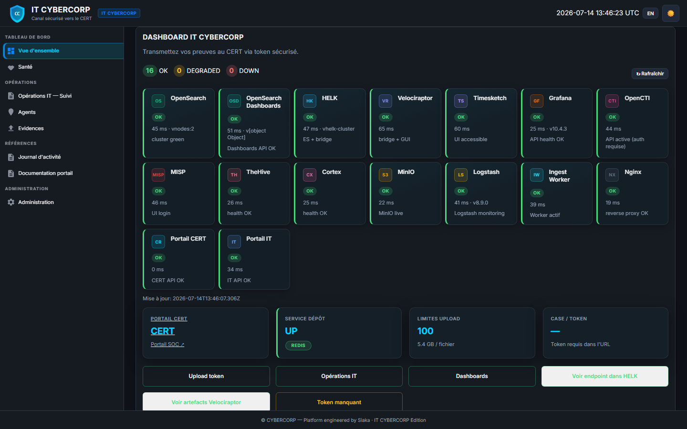
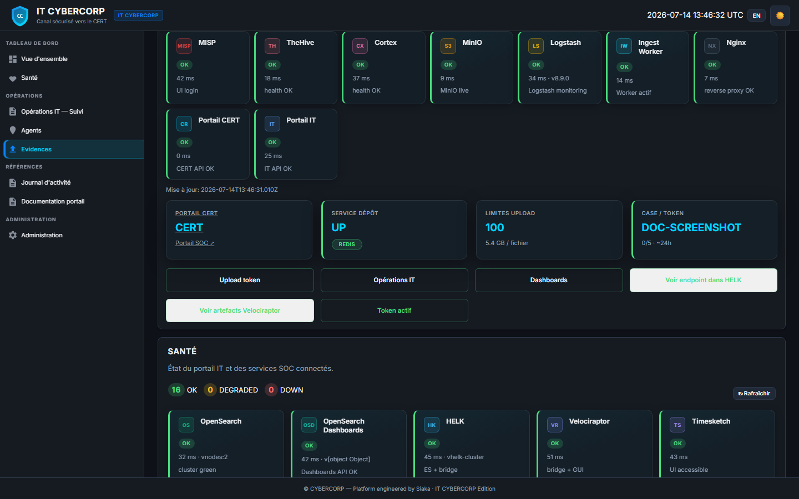
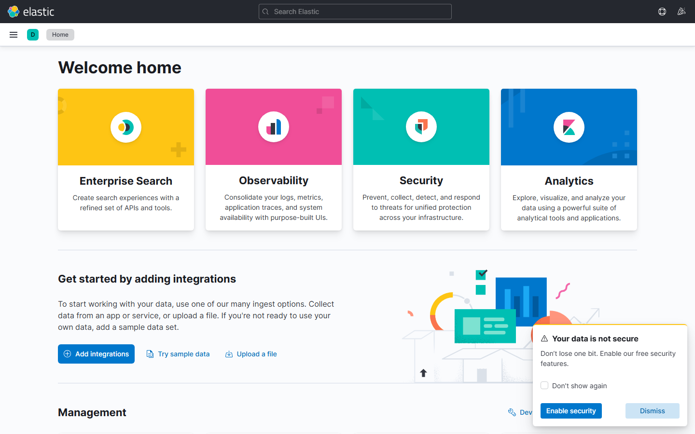
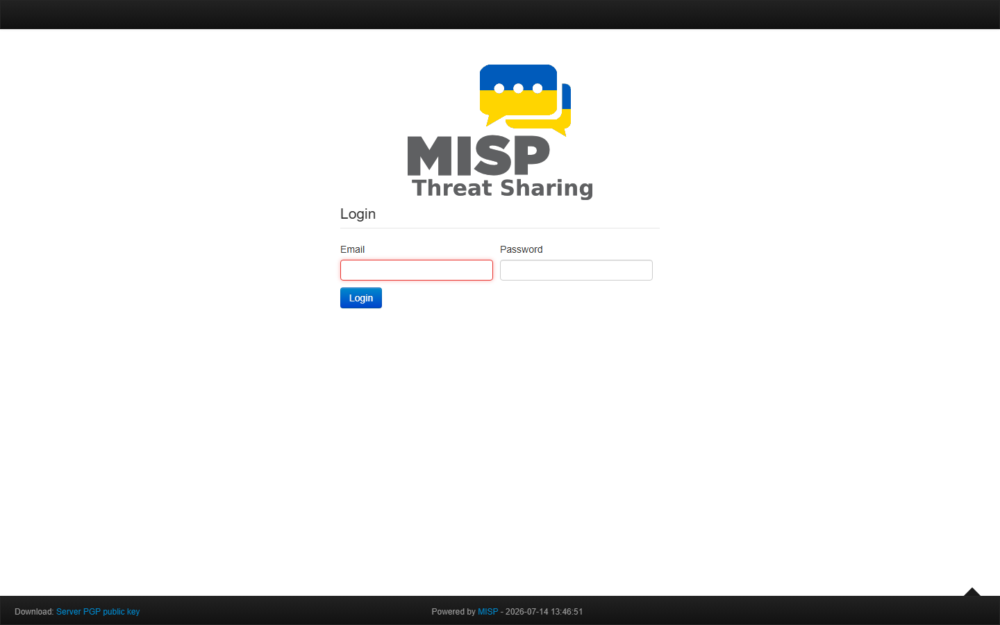
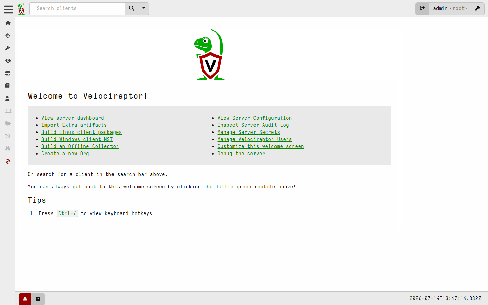

# Forensic Plateform MAX — Plateforme SOC / DFIR

Plateforme forensic et SOC **clé en main**, pensée pour le lab, la formation et les équipes CERT/DFIR. Elle regroupe ingestion, SIEM, threat intelligence, gestion d’incidents, timelines, hunting et collecte endpoint derrière un point d’entrée HTTPS unique, avec une **couche Sekoia.io v3** (Sekoia Extended Platform — workbench, console analyste, **96 cas d'usage CERT full-auto** — + PSOAR) et des portails CERT/IT premium FR/EN en mode dark/light.

**Dépôt :** [`waraperkin/forensic-plateform-max-v1`](https://github.com/waraperkin/forensic-plateform-max-v1) — snapshot portable, QA navigateur et correctifs proxy (MISP, Timesketch, Velociraptor).

**Public cible :** analystes SOC, ingénieurs DFIR, formateurs, lab interne.

---

## Overview

Forensic Minimal déploie une stack Docker orchestrée par un seul script. **Sur une VM AWS fraîche (recommandé : `/opt/forensic-plateform-max-v1`) :**

```bash
sudo mkdir -p /opt
sudo git clone https://github.com/waraperkin/forensic-plateform-max-v1.git /opt/forensic-plateform-max-v1
cd /opt/forensic-plateform-max-v1
./scripts/preflight-full-start.sh
./forensic.sh -full-start
```

Alternative (répertoire courant) :

```bash
git clone https://github.com/waraperkin/forensic-plateform-max-v1.git
cd forensic-plateform-max-v1
./scripts/preflight-full-start.sh
./forensic.sh -full-start
```

À l’issue d’un `-full-start` réussi, **aucune étape manuelle** : détection IP AWS, TLS, MISP, HELK, Velociraptor, nginx, identité site (Palo Alto) et vérification des services (16/16) sont automatiques.

### Déploiements modulaires

Outre la stack complète (`-full-start`), vous pouvez démarrer un **sous-ensemble cohérent et opérationnel** :

```bash
./forensic.sh deploy portals            # Portails CERT + IT (+ redis, MinIO, OpenSearch, nginx)
./forensic.sh deploy sekoia             # Sekoia Extended Platform (UI /sekoia + control-plane + monitor)
./forensic.sh deploy portals-sekoia     # CERT/IT + Sekoia (alias de sekoia)
./forensic.sh deploy portals-forensic   # CERT/IT + outils forensic (OSD, OpenCTI, Timesketch, TheHive, MISP, VR…)
./forensic.sh deploy full               # Équivalent à ./forensic.sh -full-start
./forensic.sh deploy --list             # Liste des modes et services
```

Chaque mode lance les dépendances nécessaires (TLS, réseaux `helk_net` / `velociraptor_net`, builds) et vérifie les endpoints du périmètre. Nginx démarre même si les outils hors mode sont absents (upstreams DNS dynamiques).

- **Accès** : `https://<IP-publique>/` (affiché en fin de script)
- **16/16 services** vérifiés via `/api/health/global` (Timesketch, MISP, Velociraptor, HELK, etc.)
- **OpenSearch Dashboards** : dashboards SIEM/TI/Observability importés
- **700+ règles** de détection et monitors d’alerting
- **Portails CERT/IT** opérationnels pour l’ingestion et les pivots cross-tool

Documentation détaillée : répertoire [`docs/`](docs/) (architecture portails, HELK, Velociraptor, QA).

### Aperçu visuel

| Portail CERT — Vue d'ensemble | Portail CERT — Centre d'accès |
|:---:|:---:|
|  |  |

| Portail IT — Dashboard | Portail IT — Upload (token) |
|:---:|:---:|
|  |  |

| HELK Kibana | MISP | Velociraptor |
|:---:|:---:|:---:|
|  |  |  |

Galerie complète (25 captures portails + outils) : [`docs/PORTAL/SCREENS.md`](docs/PORTAL/SCREENS.md) — régénération : `node scripts/capture-portal-screenshots.mjs`.

---

## Architecture

### Composants

| Couche | Services |
|--------|----------|
| **Point d’entrée** | Nginx (HTTPS), portails CERT + IT |
| **SIEM & recherche** | OpenSearch, OpenSearch Dashboards, Logstash, Filebeat |
| **Stockage** | MinIO (evidences, artefacts) |
| **Forensic timeline** | Timesketch (+ worker d’ingestion) |
| **Threat Intelligence** | OpenCTI, MISP, connecteurs TI |
| **Incident Response** | TheHive, Cortex |
| **Observabilité** | Grafana, Prometheus, Loki, Tempo |
| **Hunting & DFIR** | HELK (sidecar ES/Kibana/Logstash), Velociraptor |
| **Couche Sekoia.io** | `sekoia-controlplane` (inventaires, volumétrie, télémétrie, graphe, surveillance par hôte, **96 cas d'usage CERT full-auto**, parcours d'actifs à l'échelle, opérations en lot), `sekoia-monitor` (poller de volumétrie, moteurs d'alerting) — voir [`docs/SEKOIA.md`](docs/SEKOIA.md) et [`docs/sekoia-psoar-rebuild/`](docs/sekoia-psoar-rebuild/) |
| **Infrastructure** | PostgreSQL, Redis, RabbitMQ, Cassandra |

### Flux de données (schéma logique)

```
[Evidences / logs / agents]
        │
        ▼
  Portails CERT/IT ──► MinIO ──► ingest-worker ──► OpenSearch
        │                      │                        │
        │                      └──► Timesketch ◄──────┘
        │
        ├──► OpenCTI / MISP (IOC, enrichissement TI)
        ├──► TheHive / Cortex (cas IR, analyseurs)
        ├──► HELK (hunting, Sigma)
        └──► Velociraptor (collecte DFIR)

[Nginx HTTPS] ──► Dashboards OSD / Grafana / CTI / MISP / …
                      │
                      └──► Pivots cross-tool (host, IOC, case, timeline)
```

Les bridges `helk-bridge` et `velociraptor-bridge` synchronisent les sidecars avec la stack principale et les portails.

---

## Couche Sekoia.io (v3) — Sekoia Extended Platform & PSOAR

La console Sekoia ne sait pas produire d'inventaire exploitable, d'opération en
lot, de tableau de bord avancé, de supervision d'ingestion ni d'alerting fiable.
Cette couche construit ce qui manque, au-dessus de l'API Sekoia.

### Le verrou levé : Sekoia n'expose aucune métrique d'ingestion

`/sic/metrics`, `/ingest/metrics` et `/events/statistics` répondent 404 ;
`short_histogram` est toujours nul. Aucune volumétrie n'était donc mesurable.

La solution retenue est un **job de recherche par intake dont on ne lit que le
`total`** — 66 intakes en ~19,5 s à concurrence 8. Ce seul mécanisme a débloqué
six moteurs jusque-là inertes : volumétrie, baselines, anomalies, SLO,
prévisions et digest. Le même échantillonnage d'événements a ensuite ouvert la
qualité de parsing, la latence de livraison et l'intelligence d'actifs.

### Sekoia Extended Platform (SEP)

Deux couches complémentaires, et une console CERT dédiée aux cas d'usage.

**1. Workbench & outils** — les écrans historiques du portail (sources & santé,
détections, graphe, simulateur what-if, télémétrie à la demande, inventaire,
alerting d'ingestion, opérations en lot, stockage) plus la **surveillance par
hôte** (voir plus bas). Adossés à `analytics.py`, `inventory.py`, `graph.py`,
`hostwatch.py`, `bulkops.py`, etc.

**2. Console analyste** — adossée à `analyst.py`
(`/control/sekoia/analyst/*`), structurée en Inventaires · Monitoring ·
Dashboards · Alerting & Détections. Chaque détecteur porte son incertitude et
sa date de mesure, et refuse de conclure sous les seuils statistiques
(`MIN_POINTS`, `MIN_DRAWS`, `MIN_EVENTS`).

**3. Cas d'usage CERT** (`sekoia-sep`) — ce que Sekoia ne restitue pas.

96 analyses, 8 tableaux de bord et 10 opérations de gestion, dérivés d'une
seule mécanique : **six signaux purs** (silence, dérive, pic, instabilité,
verbosité, fantôme) appliqués à **six entités** (intakes, devices /
`log.hostname`, actifs natifs, groupes CERT, règles, dépendances). Un cas
d'usage est une ligne de catalogue (`sep_catalog.py`), pas un endpoint.

| Domaine | Contenu |
|---------|---------|
| Inventaire | état global : critiques, multi-devices, silencieux, en dérive, orphelins, incohérents |
| Monitoring | ce qui va mal maintenant (parsing, dialecte, fantômes, groupes incomplets) |
| Détection | anomalies datées (chute / pics d'ingestion, règles contradictoires, activité Admins/DCs/VIP) |
| Dashboards | intakes, devices, assets, règles, MITRE prouvé vs déclaré, dépendances, parsing |
| Gestion | opérations en masse, **simulation obligatoire** (`dry_run` par défaut) |

Le moteur (`sep.py`) tourne **en full-auto** toutes les 15 minutes : échantillon
d'événements, parsing, historique d'atomes, tranche d'actifs, évaluation des
cas de détection, persistance des déclenchements. La console s'ouvre déjà
remplie.

**Pagination à l'échelle d'un tenant réel** (`sep_crawl.py`) — l'API Sekoia
plafonne `limit` à 100 et n'offre ni curseur ni filtre temporel. Trois voies
budgétées par cycle :

- **tête** — nouveautés (`created_at` décroissant), coût = créations, pas la taille du parc ;
- **fond** — rattrapage par type (hôtes → réseaux → comptes), curseur persisté ;
- **balayage** — relecture complète périodique + réconciliation des écarts
  (suppressions pendant le parcours).

Sur le bac à sable : ~106 k actifs indexés, cycle en régime permanent ~1 s.
Conçu pour ×100 (production).

Sur `/sekoia`, la barre latérale n'affiche plus le préfixe « SEKOIA — » /
« Sekoia.IO — » : l'en-tête annonce déjà la plateforme. Les mêmes clés i18n
gardent le préfixe sur le portail CERT, où Sekoia côtoie SentinelOne.

**Notifications e-mail SEP** (`mailnotify.py`) — Alerting & drops expose un
panneau pour configurer le **serveur SMTP** (hôte, port, utilisateur, mot de
passe, from, TLS/SSL), les **destinataires** (ex. `admin@cyberdefense.ml`) et
les événements : intake silencieux, baisse de volume, clé API créée, compte
utilisateur créé/invité.

Les identifiants SMTP sont chiffrés Fernet dans le même store que la clé API
Sekoia (`SEKOIA_SECRETS_KEY` → `/data/sekoia-secrets.enc`) — **pas en clair dans
`.env`**. Les variables `SMTP_*` restent un bootstrap optionnel (migration) ;
la config UI prime dès qu’un hôte SMTP y est enregistré.

Prérequis : `SEKOIA_SECRETS_KEY` générée (`generate-secrets`). Tester depuis
SEP → Alerting & drops → « Enregistrer SMTP » puis « Envoyer un test ».

Détail : [`docs/sekoia-psoar-rebuild/18-SEKOIA-EXTENDED-PLATFORM.md`](docs/sekoia-psoar-rebuild/18-SEKOIA-EXTENDED-PLATFORM.md),
audit : [`docs/sekoia-psoar-rebuild/19-AUDIT-COMPLET-OUTIL-SEKOIA.md`](docs/sekoia-psoar-rebuild/19-AUDIT-COMPLET-OUTIL-SEKOIA.md).

### Satisfiabilité des règles — ce qu'aucun SIEM ne sait dire
La console dit quelles règles sont **activées**. Elle ne dit jamais lesquelles
peuvent **se déclencher**. Une règle Sigma teste des champs ; si aucune source
ingérée ne les produit, elle est verte, elle compte dans la couverture, et elle
ne tirera jamais. C'est une protection imaginaire — la pire espèce, parce
qu'elle rassure.

Le moteur confronte les champs exigés par chaque règle aux champs réellement
observés dans les événements, schéma que Sekoia n'expose pas et qu'on établit
par échantillonnage.

**Sur ce tenant : 305 règles activées ne peuvent pas se déclencher.** La lecture
inverse est plus actionnable : collecter `process.parent.name` en réactive 72
d'un coup.

Trois disciplines : aucun verdict négatif sous 30 événements pour un format ;
borne de fréquence rendue (règle de trois, < 3/n) ; aucun verdict négatif dur
sur une règle agnostique du format.

### Volume contre valeur
Un SIEM compte les événements et les alertes, il ne les rapproche jamais. Le
module joint la volumétrie par intake aux alertes de détection.

Sur ce tenant : **2 sources ont produit 34 millions d'événements sans lever une
seule alerte** (54,9 % du volume), et **une seule règle produit 58 % de toutes
les alertes**.

« Zéro alerte » ne veut pas dire « inutile » : une source d'accès peut ne jamais
déclencher de règle et rester indispensable à l'investigation. Le module classe,
il ne recommande pas la suppression.

### Rejeu d'une règle avant activation
Activer une règle, c'est parier : personne ne sait combien d'alertes elle
produira. Le module traduit le motif Sigma en requête de recherche et le rejoue
sur les données réelles — **840 règles sur 1 180 (71,2 %) sont traduisibles**.

Le rejeu s'applique aussi à une **sélection** de règles, depuis la même barre
d'actions que l'activation : on rejoue, on lit, puis on active. Une seule règle
ingérable suffit à condamner un lot.

Le chiffre compte des **événements**, pas des alertes : c'est une borne haute, et
chaque réponse le déclare. Le traducteur **refuse** plutôt que d'approximer
(regex, agrégations, seuils) — un chiffre faux avec l'apparence d'un fait serait
pire que pas de rejeu.

### Dérive de schéma — la panne qui ne prévient jamais
Un champ cesse d'être peuplé : les événements continuent d'arriver, la
volumétrie ne bouge pas, aucune alerte ne part, et les règles qui le testaient
s'éteignent. Le module relève le schéma réel de chaque format, compare, et
**nomme les règles mortes**.

Sur ce tenant, `process.command_line` est exigé par **84 règles activées**.

Les dérives rejoignent le **flux d'alertes commun** — plusieurs champs perdus
sur un même format forment un incident, pas dix notifications — et le poller
relève le schéma toutes les heures pour construire la ligne de base.

### Surveillance par hôte

L'alerting classique raisonne par intake. Quand une seule machine derrière un
relais cesse d'émettre, le total de la source bouge à peine et **aucune alerte
ne part**. Ce module descend au niveau de l'hôte : silence, chute, apparition,
absence d'inventaire.

Sekoia n'expose aucun compteur par machine : on mesure une **part** dans un
échantillon, appliquée au total réel de l'intake. Le volume par hôte est donc
une **estimation**, déclarée comme telle dans chaque réponse et affichée avant
les chiffres.

Cette approche impose des garde-fous, car un hôte absent d'un échantillon n'a
pas cessé d'émettre — il n'a pas été tiré :

| Garde-fou | Raison |
|---|---|
| ≥ 3 relevés, même fenêtre | un relevé de 30 min porte la moitié du volume d'un relevé d'1 h |
| présent dans **tous** les relevés | sinon l'absence n'est pas un signal |
| ≥ 15 tirages habituels | une absence fortuite dépend du **nombre de tirages**, pas du volume extrapolé |
| chute > 2 × l'erreur d'échantillonnage | ±32 % d'incertitude à 10 tirages, ±6 % à 323 : un seuil unique qualifierait le bruit de panne |

Sans historique, le module **refuse de conclure** et l'écrit en clair.

**Normale par créneau** (jour ouvré / week-end × heure) : un poste bureautique
est muet la nuit sans qu'il y ait panne. L'échelle de repli — créneau, heure,
globale — est toujours déclarée, pour distinguer « anormal par rapport aux
lundis 19 h » de « anormal par rapport à la moyenne de tout ».

**Corrélation avec les détections** : une machine qui se tait le dimanche à 3 h
est un rythme ; la même machine qui se tait vingt minutes après une alerte la
visant est le schéma d'un attaquant qui coupe la journalisation. La jointure se
fait par **UUID d'actif**, jamais par nom. Trois verdicts distincts — détection
préalable (escalade), même source (signal faible, sans escalade), non corrélable
(machine hors inventaire : absence de *moyen de chercher*, pas absence
d'alerte).

### PSOAR

**Moteur de similarité et de récurrence** — « est-ce déjà arrivé ? » est la
première question d'un analyste, et aucun outil de réponse n'y répond seul.
Quatre signaux de force décroissante (IOC partagé, machine, étiquette,
intitulé), chaque rapprochement portant ses raisons en clair. Un score n'est
rendu que si un signal a réellement joué : le moteur refuse de fabriquer une
ressemblance.

Réponse à incident complète : incidents (sévérité, statuts, assignation,
timeline, notes, evidences, IOCs typés), **playbooks** avec conditions et
actions, enrichissement CTI fédéré (OpenCTI + MISP + OpenSearch), marquage TLP,
chaîne de custody, webhooks signés HMAC-SHA256, quotas en fenêtre glissante,
rapport Markdown et purge de fin d'investigation (dry-run obligatoire, double
confirmation, audit).

### Ce que la plateforme a révélé sur le tenant

61 intakes actifs sans connecteur · 29 formats ingérés sans aucune règle ·
71 règles désactivées · 61 des 66 sources silencieuses · 8 machines sur 43
absentes de l'inventaire d'actifs · TheHive et Cortex rejettent leurs clés API
(HTTP 401) · MTTD médian de 7 s mais résolution médiane à 18,8 jours.

### Validation

```bash
./scripts/validate-sekoia.sh                       # services, routes API, télémétrie, CTI

# 678 tests unitaires du control-plane (signaux, catalogue, parcours d'actifs, …)
docker run --rm -v "$PWD/connectors/sekoia-controlplane:/w" -w /w --entrypoint sh \
  python:3.12-slim -c \
  "pip install -q -r requirements.txt pytest pytest-asyncio >/dev/null && python -m pytest -q"

# Tests unitaires PSOAR — hors image, copiés au moment de l'exécution
docker exec forensic-cert-portal mkdir -p /app/test
docker cp portal-cert/test/psoar.test.js forensic-cert-portal:/app/test/
docker cp portal-cert/test/similarity.test.js forensic-cert-portal:/app/test/
docker exec -w /app forensic-cert-portal node --test test/

# QA navigateur — console Cas d'usage CERT (96 cas, 8 dashboards, gestion)
sudo node tests/sep-ui.mjs
```

Documentation détaillée : [`docs/sekoia-psoar-rebuild/`](docs/sekoia-psoar-rebuild/)
et [`docs/sekoia-psoar-rebuild/RUN-TESTS.md`](docs/sekoia-psoar-rebuild/RUN-TESTS.md).

---

## Prerequisites

| Exigence | Recommandation |
|----------|----------------|
| **OS** | Debian 12 (bookworm) ou Ubuntu 22.04+ |
| **Docker** | Engine récent + **Docker Compose v2** (`docker compose`) |
| **Utilisateur** | Membre du groupe `docker` (ou root) |
| **CPU** | 8 cœurs minimum, **16 cœurs** recommandés |
| **RAM** | 8 Go minimum, **16–32 Go** recommandés |
| **Disque** | **100 Go+** libres (images, indices OpenSearch, evidences) |
| **Réseau** | Accès Internet pour pull d’images (premier démarrage) |

Packages utilisés par l’orchestrateur : `curl`, `openssl`, `jq`, `python3`, `git`.

### Ports critiques

Sur l’hôte, les ports suivants doivent être libres (ou détenus par cette stack) :

| Port | Usage |
|------|--------|
| **80 / 443** | Nginx (HTTP → HTTPS, services) |
| **9200** | OpenSearch (API locale) |
| **5601** | OpenSearch Dashboards (direct) |
| **5000** | Timesketch (direct, optionnel) |
| **9000 / 9001** | MinIO API / console |

> **Note :** ne pas lancer deux clones `forensic-minimal` sur la même machine sans arrêter l’autre stack (`./forensic.sh full-stop`). Les noms de conteneurs (`forensic-*`) sont fixes.

---

## Installation

### 1. Cloner le dépôt

```bash
git clone https://github.com/waraperkin/forensic-plateform-max-v1.git
cd forensic-plateform-max-v1
```

### 2. (Recommandé) Pré-vol statique

```bash
./scripts/preflight-full-start.sh
```

Valide TLS, wiring Velociraptor, nginx, bootstrap IP (~1 min). Échoue avant d’engager les ~2 h du full-start si une config est incohérente.

### 3. Lancer l’orchestrateur complet

```bash
./forensic.sh -full-start
```

C’est tout — pas de `post-start-align`, pas de `nginx reload`, pas d’édition manuelle de `.env`.

Alias équivalents : `./forensic.sh full-start`, `./forensic.sh full`, `./forensic.sh rebuild`.

**Durée estimée :** 1 à 2 heures au premier démarrage (pull d’images, build, activation SIEM/TI, import dashboards).

### 3bis. Déploiements modulaires (sous-ensembles)

Si vous n’avez pas besoin de toute la stack :

| Mode | Contenu opérationnel |
|------|----------------------|
| `portals` | Portails CERT + IT, redis, MinIO, OpenSearch, nginx |
| `sekoia` / `portals-sekoia` | Ci-dessus + Sekoia control-plane, monitor, UI `/sekoia` |
| `portals-forensic` | Portails + OSD, Logstash, OpenCTI, Timesketch, TheHive, MISP, Cortex, Grafana, Velociraptor… |
| `full` | Stack complète (`-full-start`) |

```bash
./forensic.sh deploy portals
./forensic.sh deploy sekoia
./forensic.sh deploy portals-forensic
```

### Ce que fait le bootstrap (Phase 0)

Sur une machine vierge, **aucune configuration manuelle** n’est requise :

1. Copie `.env.example` → `.env` et génération des **secrets labo documentés** (`F0r3ns1c_*` — portail, MISP, OpenCTI, Grafana, MinIO, etc.)
2. **Réparation automatique** si `.env` corrompu (clés traduites type `MOT_DE_PASSE_*`, `HÔTE_PUBLIC`) : sauvegarde `.env.corrupt.*.bak`, recréation depuis `.env.example`
3. **Détection automatique de l’IP publique** (`scripts/lib/host-ip.sh`) :
   - variable `PUBLIC_HOST` si définie explicitement ;
   - sinon **IMDS AWS** (`public-ipv4`) sur EC2 ;
   - sinon première IP routable de l’hôte ;
   - sinon IP locale / `hostname -I`.
3. Injection de cette IP dans `.env` (`PUBLIC_HOST`, `GRAFANA_*`, `MISP_PUBLIC_BASE_URL`, `TIMESKETCH_EXTERNAL_URL`, etc.) — les anciens placeholders lab (`192.0.2.9`) sont **toujours remplacés**.
4. Génération **TLS** : CA interne, certificat serveur (SAN = IP détectée), certs portails / HELK / Velociraptor
5. Création des dossiers persistants, patch Nginx / portails / `timesketch.conf`
6. Création des réseaux Docker externes `helk_net` (172.30.0.0/24) et `velociraptor_net` (172.31.0.0/24)
7. **Post-démarrage** : synchronisation admin portail CERT (`ensure-portal-admin.sh`), Velociraptor (port hôte **18000**), test login automatique

> **Important :** ne **jamais traduire** les noms de variables dans `.env` / `.env.example` (uniquement des clés ASCII `POSTGRES_PASSWORD`, `PUBLIC_HOST`, …). Ne pas éditer manuellement les URLs avec une IP fixe : laisser `PUBLIC_HOST=` vide.

### Déploiement sur VM AWS (EC2)

Procédure recommandée sur une instance **vierge** (Ubuntu 22.04+ ou Debian 12) :

```bash
git clone https://github.com/waraperkin/forensic-plateform-max-v1.git
cd forensic-plateform-max-v1
./scripts/preflight-full-start.sh
./forensic.sh -full-start
```

L’IP publique et les URLs HTTPS sont affichées en fin de script (`./forensic.sh urls` reste disponible ensuite).

**Avant d’ouvrir le navigateur :**

| Étape | Action |
|-------|--------|
| **Security Group** | Autoriser TCP **80** et **443** (entrée) depuis votre IP ou votre réseau |
| **IP d’accès** | Utiliser l’**Elastic IP publique** affichée par `./forensic.sh urls` (pas l’IP privée `172.31.x.x`) |
| **Certificat** | Accepter l’exception navigateur (certificat auto-signé) ou importer `nginx/certs/ca/ca.crt` |

**Vérification rapide après démarrage :**

```bash
IP=$(./forensic.sh urls 2>/dev/null | grep -oE '[0-9]+\.[0-9]+\.[0-9]+\.[0-9]+' | head -1)
curl -sk "https://${IP}/nginx-health"
curl -sk "https://${IP}/api/health/global" | jq .
```

Réponse attendue : `summary.ok` = 11, `summary.down` = 0.

**Forcer une IP précise** (Elastic IP, autre interface) :

```bash
PUBLIC_HOST=<votre-ip-publique> ./forensic.sh tls
docker compose up -d --force-recreate nginx cert-portal it-portal grafana
```

**Si un ancien `.env` contient encore `192.0.2.9`** (IP du lab d’origine), relancer simplement :

```bash
./forensic.sh -full-start
```

Le patch IP est ré-appliqué à chaque démarrage (`pre_start`).

### Options utiles

```bash
# Ignorer les tests Playwright (démarrage plus rapide)
FP_ORCH_SKIP_PLAYWRIGHT=1 ./forensic.sh -full-start

# Seuil disque critique plus haut si l’hôte est presque plein
FP_DISK_CRITICAL_PCT=96 ./forensic.sh -full-start
```

---

## Access URLs

Remplacez `<IP>` par l’adresse affichée par `./forensic.sh urls` (détection automatique, priorité à l’**IP publique AWS** sur EC2).

```bash
./forensic.sh urls
```

Tous les services passent par **HTTPS** (certificat auto-signé — accepter l’exception navigateur ou importer la CA depuis `nginx/certs/ca/ca.crt`).

| Service | URL | Authentification |
|---------|-----|------------------|
| **Portail CERT** | `https://<IP>/` | Compte portail (bootstrap : `admin` / voir note ci-dessous) |
| **Portail IT** | `https://<IP>/it/` | Token de dépôt généré par le CERT |
| **Santé globale** | `https://<IP>/api/health/global` | Aucune (JSON) |
| **OpenSearch Dashboards** | `https://<IP>/dashboards/` | Session portail / basic |
| **Grafana** | `https://<IP>/grafana/` | Admin Grafana (mot de passe dans `.env`) |
| **Timesketch** | `https://<IP>/timesketch/` | Compte Timesketch (`.env`) |
| **OpenCTI** | `https://<IP>/cti/` | Admin OpenCTI (`.env`) |
| **MISP** | `https://<IP>/misp/` | Compte MISP |
| **TheHive** | `https://<IP>/thehive/` | Compte TheHive |
| **Cortex** | `https://<IP>/cortex/` | Compte Cortex |
| **MinIO** | `https://<IP>/minio/` | Credentials MinIO (`.env`) |
| **HELK Kibana** | `https://<IP>/helk/kibana/` | Kibana HELK |
| **Velociraptor** | `https://<IP>/velociraptor/` | Admin VR |

**Timesketch direct (sans Nginx) :** `http://<IP>:5000/`

**Identifiants portail CERT (premier boot) :** après bootstrap, connexion **`admin` / valeur de `PORTAL_ADMIN_PASSWORD`** (définie dans `.env`). Si la variable est absente, un **mot de passe aléatoire est généré et affiché une fois dans les logs du conteneur** (`docker logs forensic-cert-portal`). Le full-start exécute `ensure-portal-admin.sh` pour aligner le compte local. Dépannage manuel : `./forensic.sh repair-env` ou `./scripts/reset-portal-admin.sh`.

Les secrets effectifs sont dans `.env` (Centre d’accès du portail CERT, ou `./forensic.sh urls --reveal`) — **ne jamais committer ce fichier**.

### Secrets et mots de passe labo (`lib/platform-secrets.js`)

Le fichier `lib/platform-secrets.js` contient des **valeurs par défaut de démonstration** (`F0r3ns1c_*_2024!`, etc.) utilisées **uniquement en mode dev** (`NODE_ENV != production`, voir `lib/cors-policy.js → isDevMode()`). En production, une variable absente renvoie une valeur vide / un fallback neutre — jamais un mot de passe codé en dur (audit P-04).

**En production**, le premier `./forensic.sh -full-start` génère des secrets aléatoires dans `.env` (non versionné). Ces defaults lab ne doivent **jamais** être considérés comme des identifiants réels : changez-les systématiquement via `.env` ou les variables d’environnement du déploiement. Le Centre d’accès du portail CERT affiche les credentials effectifs après bootstrap.

---

## Health & Validation

### Vérification rapide

```bash
# Santé agrégée (16 services)
curl -sk https://<IP>/api/health/global | jq .

# Commandes intégrées
./forensic.sh check-health
./forensic.sh status
```

Réponse attendue de `/api/health/global` : `summary.ok` = 11, `summary.down` = 0.

### Logs principaux

| Fichier | Contenu |
|---------|---------|
| `logs/forensic_start.log` | Démarrage stack Docker |
| `logs/forensic_install.log` | Bootstrap, packages, `.env` |
| `logs/forensic_network.log` | Réseaux Docker, migration subnet |
| `logs/opensearch_dashboards_import.log` | Import dashboards OSD |
| `logs/misp-init.log` | Initialisation MISP |
| `logs/soc-autonomous.log` | Module SOC autonome |

### Commandes de cycle de vie

| Commande | Description |
|----------|-------------|
| `./forensic.sh -full-start` | Installation + build + activation complète |
| `./forensic.sh deploy <mode>` | Déploiement modulaire (`portals`, `sekoia`, `portals-sekoia`, `portals-forensic`, `full`) |
| `./forensic.sh start` | Démarrage rapide (sans rebuild complet) |
| `./forensic.sh full-stop` | Arrêt de toute la stack |
| `./forensic.sh full-restart` | Redémarrage |
| `./forensic.sh tls` | Régénération / reload certificats |
| `./forensic.sh logs [service]` | Logs Docker |

---

## Usage

### Ingestion d’evidences

1. **Analyste CERT** : connexion au portail → génération d’un **token de dépôt** (`POST /api/tokens/generate`)
2. **Équipe IT** : `https://<IP>/it/?token=…` → upload fichiers
3. Le **ingest-worker** traite les fichiers (MinIO → OpenSearch, Timesketch, enrichissement TI)

Suivi : onglets Ingest / Operations du portail CERT, dashboards `fp-opensearch-overview`, `fp-observability-pipeline`.

### Threat Intelligence

- **OpenCTI** : hub CTI, connecteurs (MITRE, CVE, URLhaus, etc.)
- **MISP** : partage et corrélation IOC
- Sync vers OpenSearch : indices `forensic-ti-*`, dashboards `fp-ti-overview`, `fp-ioc-matches`
- Règles : 700+ monitors `FP-DET-*` dans OpenSearch Alerting

### Pivot cross-tool

Depuis le **portail CERT** : liens vers HELK, Velociraptor, OpenCTI, Timesketch, dashboards OSD. Les saved searches et drill-downs FP (`fp-drill-*`, `fp-pivot-*`) permettent de passer d’une vue agrégée à Discover (events, logs, IOC, MITRE).

### Hunting & DFIR

- **HELK** : Kibana hunting, règles Sigma, ingestion lab — **index patterns** (`helk-sysmon-*`, `helk-detections-*`, etc.) importés automatiquement au démarrage via `scripts/ensure-helk-kibana-objects.sh` (Windows : `node scripts/helk-kibana-import.mjs`)
- **Velociraptor** : collecte endpoint, export vers la plateforme via bridge — `GUI.public_url` et `trusted_origins` alignés sur `FP_HTTPS_PORT` (ex. `:8443`)

Scripts de setup sidecar : `scripts/setup-sidecars.sh` (automatique à chaque `full-start`) ou `scripts/helk_velociraptor_master_setup.sh` (setup complet lab).

**URLs directes :**

| Outil | URL |
|-------|-----|
| MISP | `https://<hôte>/misp/` |
| HELK Kibana | `https://<hôte>/helk/kibana/` |
| Velociraptor | `https://<hôte>/velociraptor/` |

**Vérification après démarrage :**

```bash
bash scripts/test_tools_access.sh
# ou avec BASE_URL explicite :
BASE_URL=https://<hôte> bash scripts/test_tools_access.sh
```

**Si MISP / HELK / Velociraptor restent inaccessibles :**

```bash
# 1) Sidecars + config Velociraptor
bash scripts/setup-sidecars.sh

# 2) URL publique MISP (baseurl CakePHP)
bash scripts/misp-configure-host.sh

# 3) Recréer nginx + portails
docker compose up -d --force-recreate nginx cert-portal it-portal

# 4) Logs
docker logs forensic-misp --tail 50
docker logs forensic-nginx --tail 50
docker logs helk-kibana --tail 30 2>/dev/null || true
docker logs velociraptor-server --tail 30 2>/dev/null || true
```

---

## Accès par IP (défaut) et Palo Alto

Par défaut la plateforme utilise **`https://<IP-publique>/`** (pas le DNS EC2). Le bootstrap détecte l'IP via IMDS AWS.

```bash
git clone https://github.com/waraperkin/forensic-plateform-max-v1.git
cd forensic-plateform-max-v1
./forensic.sh -full-start
# Security Group AWS : TCP 80 + 443 ouverts
```

> **Note :** le dépôt `fp-final2` (référence lab, lecture seule) utilise un certificat **CN=forensic-platform** avec l’**IP publique en SAN** — même modèle que `forensic-minimal` depuis la v2.1 (accès `https://<IP>/login.html`).

### Pages d'identification (crawlers URL filtering)

Après `-full-start`, ces URLs sont servies automatiquement :

| URL | Rôle |
|-----|------|
| `https://<IP>/site-info.html` | Description SOC/DFIR (mots-clés sécurité) |
| `https://<IP>/robots.txt` | Autorise les crawlers |
| `https://<IP>/.well-known/security.txt` | Contact sécurité (RFC 9116) |

Variables `.env` : `FP_SITE_ORG_NAME`, `FP_SITE_DESCRIPTION`, `FP_SITE_CONTACT_EMAIL`.

### Palo Alto « Uncategorized » / « Unknown »

**Limite importante :** PAN-DB catégorise surtout les **noms de domaine**. Une **IP AWS nue** reste souvent « unknown » — le serveur ne peut pas forcer la catégorie à distance.

**Actions efficaces (par ordre de fiabilité) :**

1. **Custom URL Category** sur le firewall (admin PA) — ajouter l'IP au profil SOC  
2. **Allowlist** destination `IP:443` pour le groupe analystes  
3. **Recatégorisation** : https://urlfiltering.paloaltonetworks.com/ avec `https://<IP>/site-info.html`  
4. **Domaine interne** (si IT refuse l'IP) : `PUBLIC_HOSTNAME=... ./scripts/setup-public-access.sh`

Le DNS EC2 (`ec2-…amazonaws.com`) est **redirigé automatiquement vers l'IP** pour éviter les boucles de redirection.

---

## Accès derrière proxy d'entreprise (PROMADOR / Zscaler)

Les proxys d'entreprise bloquent souvent les sites en **`https://<IP>/`** (catégorie *Uncategorized* / IP nue), alors qu'un **nom de domaine** peut être autorisé par IT.

### Solution recommandée : nom de domaine

1. Créer un enregistrement DNS **A** : `forensic-lab.votre-entreprise.com` → Elastic IP AWS  
2. Configurer la plateforme :

```bash
PUBLIC_HOSTNAME=forensic-lab.votre-entreprise.com ./scripts/setup-public-access.sh
./forensic.sh -full-start
```

3. Demander à IT l'**allowlist** du domaine (plus simple qu'une IP).  
4. Accéder via `https://forensic-lab.votre-entreprise.com/` (et non l'IP brute).

Dans `.env`, `PUBLIC_HOSTNAME` force le SAN DNS du certificat et toutes les URLs (`MISP`, `Grafana`, `Velociraptor`, portails).

### Pourquoi d'anciennes versions semblaient fonctionner

Les versions antérieures utilisaient souvent un **nom d'hôte** ou un certificat reconnu, pas une IP nue. L'accès direct `https://54.x.x.x/` déclenche aujourd'hui le blocage *Blocked Website / Uncategorized* sur de nombreux proxys.

### Alternatives

| Option | Usage |
|--------|--------|
| VPN site-à-site AWS | Accès sans passer par le proxy navigateur |
| Tunnel SSH | `ssh -L 8443:127.0.0.1:443 ec2-user@<ip>` → `https://localhost:8443/` |
| Hotspot / réseau hors entreprise | Test rapide pour confirmer que la VM fonctionne |
| Let's Encrypt | Après `PUBLIC_HOSTNAME`, certificat public reconnu (`certbot`) |

### Docker Desktop (Windows) — ports alternatifs

Si les ports **80/443** sont occupés (HTTP.sys, IIS), copiez `config/local-ports.env.example` vers `config/local-ports.env` et ajustez `FP_HTTPS_PORT` (ex. `8443`). Accès : `https://localhost:8443/`.

Après modification de `.env`, régénérez la config Timesketch (compatible CRLF Windows) :

```bash
node scripts/generate-timesketch-conf.mjs
# ou : bash scripts/generate-timesketch-conf.sh
docker compose --env-file .env --env-file config/local-ports.env up -d --no-deps --force-recreate timesketch-web timesketch-worker
```

Les scripts shell du dépôt sont en **LF** (`.gitattributes`) — évite les crash loops Timesketch sur Windows.

---

## Tests

### Tests bootstrap & IP (sans Docker)

À lancer après clone ou modification du bootstrap — valide qu’aucune IP lab figée (`192.0.2.9`) ne reste dans la chaîne critique :

```bash
bash scripts/test_host_ip.sh
python3 scripts/test_bootstrap_env_host.py
bash scripts/test_nginx_config.sh
bash scripts/test_bootstrap_fresh_install.sh   # simule une install fraîche (IP fictive)
bash scripts/test_no_lab_ip_residual.sh           # pas d'IP lab 192.0.2.9 dans configs critiques
bash scripts/test_proxy_subpath_config.sh    # HELK/MISP/VR proxy (anti redirect loop)
bash scripts/test_tools_access.sh              # MISP / HELK / VR / santé (VM démarrée)
bash scripts/verify-platform-ready.sh          # portail + 11 outils via HTTPS (VM démarrée)
```

En cas d’échec du `-full-start` :

```bash
./forensic.sh -full-start   # relancer (idempotent)
```

### Tests intégrés au full-start

L’orchestrateur exécute notamment :

- `scripts/ui_campaign_verify.py` — campagne UI / endpoints
- Vérification SIEM : `scripts/opensearch_siem_full_verify.py`
- Tests Playwright (sauf si `FP_ORCH_SKIP_PLAYWRIGHT=1`)

### Playwright (manuel)

```bash
node tests/scripts/browser-tools-audit.mjs   # BASE_URL=https://localhost:8443
node scripts/capture-portal-screenshots.mjs  # docs/images/ — portails + outils
cd tests
npm install
npx playwright install chromium
BASE_URL=https://<IP> npm test
```

Projets disponibles : `ui`, `playwright`, `ui-integration` (voir `tests/package.json`).

### Couche Sekoia (SEP + PSOAR)

```bash
# 678 tests unitaires du control-plane
docker run --rm -v "$PWD/connectors/sekoia-controlplane:/w" -w /w --entrypoint sh \
  python:3.12-slim -c \
  "pip install -q -r requirements.txt pytest pytest-asyncio >/dev/null && python -m pytest -q"

# PSOAR (playbooks, typage IOC, TLP, similarité)
docker exec forensic-cert-portal mkdir -p /app/test
docker cp portal-cert/test/psoar.test.js forensic-cert-portal:/app/test/
docker cp portal-cert/test/similarity.test.js forensic-cert-portal:/app/test/
docker exec -w /app forensic-cert-portal node --test test/

# Consoles navigateur (un script à la fois)
sudo node tests/sep-ui.mjs          # Cas d'usage CERT
sudo node tests/sekoia-tool.mjs     # outil /sekoia
sudo node tests/analyst-ui.mjs      # console analyste
```

Les tests unitaires restent **hors des images de production**. Voir
[`docs/sekoia-psoar-rebuild/RUN-TESTS.md`](docs/sekoia-psoar-rebuild/RUN-TESTS.md).

### Scripts de validation ciblés

```bash
python3 scripts/global_health_dashboard_verify.py
python3 scripts/helk_velociraptor_master_verify.py
python3 scripts/opensearch_siem_full_verify.py
./forensic.sh ui-campaign
```

---

## Limitations & notes

| Sujet | Détail |
|-------|--------|
| **Durée** | Le premier `-full-start` est long (build + activation SIEM/TI + 700 règles). Prévoir 1–2 h. |
| **Ressources** | Machine dédiée fortement recommandée ; éviter les VMs sous-dimensionnées (< 8 Go RAM). |
| **Production Internet** | Certificats auto-signés, secrets générés localement — **ne pas exposer tel quel sur Internet** sans hardening (WAF, certificats publics, rotation secrets, sauvegardes). |
| **Multi-instance** | Un seul déploiement par hôte conseillé (noms de conteneurs fixes, subnets Docker). |
| **Disque** | OpenSearch et MinIO consomment de l’espace rapidement ; surveiller `df` et les logs. |
| **MISP / OpenCTI** | Premier démarrage : 2–5 min de stabilisation (normal). |

### Dépannage rapide

| Symptôme | Action |
|----------|--------|
| Timesketch **502** / health DOWN | `node scripts/generate-timesketch-conf.mjs` puis recreate `timesketch-web` — vérifier alignement `POSTGRES_PASSWORD` (.env) |
| MISP login **sans CSS** (assets 302) | Recharger nginx (`docker exec forensic-nginx nginx -s reload`) — locations `^~ /misp/css/` dans `forensic.conf` |
| Velociraptor **503** API / redirect loop | `Frontend.hostname: 127.0.0.1` dans `velociraptor/config/server.config.yaml` ; upstream dynamique `$velociraptor_upstream` (HTTP plain) ; `./forensic.sh repair-vr` |
| Velociraptor **Forbidden - origin invalid** | `GUI.public_url` doit inclure le port (`https://localhost:8443/velociraptor/app/index.html`) + `trusted_origins` ; nginx : `Host`/`X-Forwarded-Host` = `$http_host` ; `bash velociraptor/scripts/generate-config.sh` puis recreate `velociraptor-server` |
| HELK Discover **vide** (0 index pattern) | `node scripts/helk-kibana-import.mjs` ou `bash scripts/ensure-helk-kibana-objects.sh` — intégré à `post-start-align.sh` / `setup-sidecars.sh` |
| HELK Discover **sans événements** | Élargir la plage temporelle (ex. **7 jours**) — les données lab datent de jours précédents, pas des 15 dernières minutes |
| Cortex **ERR_CONNECTION_REFUSED** / redirect sans port | `node scripts/align-subpath-public-urls.mjs` — `application.baseUrl` + nginx `proxy_redirect` ; recreate `forensic-cortex` |
| MISP **boucle redirect** / login sans CSS | `MISP.baseurl` doit inclure le port (`https://localhost:8443/misp`) — `docker exec -e MISP_PUBLIC_BASE_URL=… forensic-misp bash /scripts/misp-configure-public-url.sh` |
| Portail / outils inaccessibles depuis le navigateur (AWS) | Vérifier Security Group TCP 80/443 ; utiliser l’**IP publique** (`./forensic.sh urls`), pas l’IP privée EC2 |
| URLs ou Grafana/MISP cassés (mauvaise IP) | `PUBLIC_HOST=<ip-publique> ./forensic.sh tls` puis `docker compose up -d --force-recreate nginx cert-portal it-portal grafana` |
| MISP login boucle / CSRF | `bash scripts/misp-configure-host.sh` puis recharger `/misp/` |
| HELK ou Velociraptor 502 | `./forensic.sh repair-vr` (ou `bash scripts/repair-velociraptor-access.sh`) — ne pas utiliser `proxy_pass https://` vers VR |
| Velociraptor redirect vers mauvaise IP | `PUBLIC_HOST=<ip> bash velociraptor/scripts/generate-config.sh` puis recréer sidecar VR |
| HELK / VR boucle de redirection | Relancer `./forensic.sh -full-start` |
| MISP « ERR_NAME_NOT_RESOLVED https » | `bash scripts/misp-configure-host.sh` |
| Palo Alto bloque l'IP (Uncategorized) | `bash scripts/print-paloalto-allowlist-guide.sh` |
| Proxy entreprise bloque l'IP | Custom URL category PA **ou** `PUBLIC_HOSTNAME` + `setup-public-access.sh` |
| Certificat navigateur refusé | Accepter l’exception ou `./forensic.sh tls` |
| OpenSearch cluster red | `./forensic.sh fix-opensearch` |
| Port déjà utilisé | `./forensic.sh full-stop` sur l’autre stack, ou libérer le port |
| Import OSD incomplet | Relancer `./forensic.sh opensearch-dashboards` ou `bash scripts/opensearch_dashboards_import_fp.sh` |

---

## Structure du dépôt

```
forensic-plateform-max-v1/
├── forensic.sh              # Orchestrateur principal
├── docker-compose.yml       # Stack Docker
├── scripts/                 # Bootstrap, activation SIEM/TI, bridges
├── docs/images/             # Captures portails CERT/IT + outils SOC
├── config/nginx/            # Reverse proxy HTTPS
├── portal-cert/ portal-it/  # Portails opérationnels
├── dashboards/              # Saved objects OpenSearch Dashboards
├── helk/ velociraptor/      # Sidecars hunting & DFIR
├── connectors/
│   ├── sekoia-controlplane/ # SEP : sep.py, sep_catalog, sep_crawl, sep_signals, …
│   └── sekoia-monitor/      # Poller de volumétrie & alerting
├── portal-shared/           # sekoia-sep.js, workbench, consoles PSOAR
├── tests/                   # Playwright (sep-ui, sekoia-tool, analyst-ui, …)
└── docs/                    # Documentation détaillée
    └── sekoia-psoar-rebuild/  # Specs SEP/PSOAR + RUN-TESTS.md
```

---

## License & credits

- Projet **forensic-plateform-max-v1** — plateforme CYBERCORP / lab SOC ([GitHub](https://github.com/waraperkin/forensic-plateform-max-v1)).
- Composants tiers sous leurs licences respectives (OpenSearch, Grafana, OpenCTI, MISP, TheHive, Timesketch, Velociraptor, HELK, Sigma, etc.).
- Règles Sigma HELK : voir `helk/sigma/LICENSE`.

### Bruit attendu en environnement lab (non-critique)

Ces messages sont **inoffensifs et documentés** — ils ne signalent pas de panne :

- **TheHive — `No license set as current was found in database`** : TheHive fonctionne en édition communautaire sans licence commerciale ; l'avertissement est purement informatif (toutes les API/cases restent opérationnelles).
- **CSP `script-src` inline (OpenSearch Dashboards / HELK Kibana)** : les consoles navigateur affichent des avertissements CSP sur les scripts inline — configuration stricte volontaire en lab, sans impact fonctionnel.
- **OSD « home »** : la page d'accueil upstream d'OpenSearch Dashboards 2.12 contient un bug JS (`TypeError … 'split'`) quand `server.basePath` est actif ; la plateforme pose `defaultRoute` sur l'overview FP à l'import des dashboards (étape 3c de `scripts/opensearch_dashboards_import_fp.sh`) pour le court-circuiter.
- **MISP — 404 `getOrgLogo`** : supprimés par `fix_org_logos()` (`scripts/misp_master_lib.py`) qui pose un logo plateforme sur les organisations qui n'en ont pas.

Pour la documentation approfondie : [`docs/FORENSIC-MINIMAL.md`](docs/FORENSIC-MINIMAL.md), [`docs/PORTAL/OVERVIEW.md`](docs/PORTAL/OVERVIEW.md).
