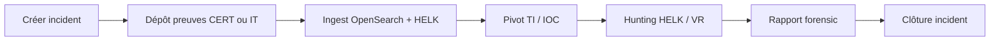

# Guide d'investigation forensic — 7 scénarios CERT

Ce guide décrit comment une équipe CERT expérimentée utilise la plateforme de bout en bout pour sept scénarios réalistes. Chaque scénario inclut des preuves (logs device/application), des IOC attendus dans **OpenCTI** et **MISP**, les **index OpenSearch** et **datasets HELK** cibles, et le workflow portail.

Les captures d'écran de référence sont produites par :

```bash
python scripts/cert_forensic_use_cases_e2e.py          # ingestion + validation API
node tests/scripts/cert-analyst-7uc-browser.mjs        # parcours analyste + screenshots
node tests/scripts/click-cert-portal-all-buttons.mjs   # couverture UI complète
```

Artefacts : `tests/artifacts/cert-analyst-7uc/` et `reports/cert-use-cases-e2e.json`.

## Prérequis livraison

1. Stack démarrée : `./forensic.sh full-start` (ou équivalent Docker Compose).
2. Bootstrap IOC des 7 UC (OpenSearch TI + OpenCTI + MISP) :

```bash
python scripts/cert_forensic_use_cases_e2e.py --bootstrap-only
# ou
python scripts/platform_usecase_bootstrap.py
```

3. Validation automatisée :

```bash
python scripts/cert_forensic_use_cases_e2e.py
python scripts/forensic_report_verify.py
python scripts/enterprise_verify.py
```

4. Portail : `https://localhost:8443` — compte `admin` (voir `.env`).

---

## Vue d'ensemble des 7 use cases

| UC | Cas | Scénario | Hôte | Index OpenSearch | Dataset HELK | IOC clés |
|----|-----|----------|------|------------------|--------------|----------|
| UC1 | `CASE-UC01-RANSOM` | Ransomware Windows | lab-win01 | `forensic-windows*` | windows.sysmon, windows.events | 203.0.113.50 |
| UC2 | `CASE-UC02-WEB` | Webshell Linux | lab-linux01 | `forensic-linux*` | linux.syslog | 198.51.100.77, upload.php |
| UC3 | `CASE-UC03-C2` | Corrélation C2 | lab-win01 | `forensic-windows*` | windows.events | 203.0.113.50, c2-panel.evil.test |
| UC4 | `CASE-UC04-LATMOVE` | Mouvement latéral | lab-win01 → lab-linux01 | `forensic-windows*` | windows.events | 192.0.2.21 |
| UC5 | `CASE-UC05-EXFIL` | Incident 360° DFIR | lab-win01 | `forensic-windows*` | windows.events | 93.184.216.34 |
| UC6 | `CASE-UC06-CLOUD` | CloudTrail AWS (IT) | aws-account | `forensic-cloud*` | cloud.aws.cloudtrail | 198.51.100.201 |
| UC7 | `CASE-UC07-NETWORK` | Zeek DNS/HTTP C2 (IT) | edge-fw01 | `forensic-network*` | network.zeek | malicious.example.com |

Fixtures : `tests/fixtures/use-cases/`.

---

## Workflow analyste type (tous UC)



### Étapes portail

1. **Incidents** — créer ou ouvrir l'incident, filtrer par `case_id`.
2. **Ingest & preuves** — vérifier uploads, statut parsing, index cible (`forensic-windows*`, etc.).
3. **Threat Intel** — rechercher l'IOC ; confirmer présence OpenCTI/MISP et corrélation `ti_match` sur les events.
4. **HELK Hunting** — sync findings, pivot host/IOC, export Timesketch si besoin.
5. **Velociraptor DFIR** — collecte playbook (`windows-triage-full`, `linux-triage-full`, `memory-forensics`).
6. **Rapports forensic** — collecter preuves, enrichir (IA locale optionnelle), exporter HTML/MD.
7. **OpenSearch Dashboards** — playbooks Analyst, TI Overview, DFIR Senior (`/dashboards/`).

Screenshot référence : `tests/artifacts/cert-analyst-7uc/uc1-incidents.png`, `uc1-forensic-reports.png`, etc.

---

## UC1 — Ransomware Windows (lab-win01)

**Contexte** : chiffrement suspect, connexions C2 depuis un poste Windows.

**Preuves** :
- `uc01-ransomware-sysmon.jsonl` (Sysmon)
- `uc01-ransomware-security.jsonl` (Security log)

**Actions CERT** :
1. Upload via portail CERT (`POST /api/upload`) avec `case_id=CASE-UC01-RANSOM`, `os_type=windows`, HELK activé.
2. Vérifier `forensic-windows-*` et corrélation TI sur `203.0.113.50`.
3. HELK : lab ingest + sync → indices `helk-findings`.
4. Velociraptor : `windows-triage-full` sur lab-win01, export Timesketch.
5. Rapport : modèle `standard-ir`, section timeline + IOC.

**Indices attendus** : ≥ 1 doc dans `forensic-windows*` par `case_id` ; HELK `windows.sysmon` / `windows.events`.

---

## UC2 — Compromission web Linux (lab-linux01)

**Contexte** : webshell PHP, scans HTTP, exfiltration initiale.

**Preuves** : `uc02-linux-web.jsonl`

**Actions** :
1. Upload `linux` → index `forensic-linux*`.
2. Rechercher IOC `198.51.100.77` et URL `http://lab-linux01/upload.php` dans Threat Intel.
3. HELK pivot hostname `lab-linux01`.
4. Velociraptor `linux-triage-full`.
5. Clôturer incident après containment.

---

## UC3 — Corrélation menace C2

**Contexte** : beaconing vers IP/domaine C2 connu.

**Preuves** : `uc03-c2-threat.jsonl`

**Actions** :
1. Vérifier IOC dans OpenCTI **et** MISP (bootstrap ou sync CTI).
2. Confirmer `ti_match: true` sur events du cas.
3. Export IOC vers OpenCTI via `POST /api/helk/export-cti`.
4. Dashboard OSD **TI Overview** / **IOC Matches**.

---

## UC4 — Mouvement latéral

**Contexte** : authentification distante win → linux.

**Preuves** : `uc04-lateral-movement.jsonl`

**Actions** :
1. Timeline cross-host dans Timesketch (export HELK).
2. Velociraptor collecte sur source.
3. Article KB post-incident (`POST /api/master/kb`).

---

## UC5 — Incident 360° (exfiltration)

**Contexte** : workflow DFIR complet — mémoire, exfil, CTI, santé plateforme.

**Preuves** : `uc05-exfiltration.jsonl`

**Actions** :
1. Seed données master (tickets, assets) si démo.
2. VR `memory-forensics` + export full OpenSearch/MinIO.
3. Export CTI + Timesketch.
4. API événements incident : `GET /api/master/incidents/{case_id}/events`.
5. Rapport exécutif `executive-brief`.

---

## UC6 — CloudTrail AWS (dépôt IT)

**Contexte** : clé IAM compromise, accès S3 sensible — l'équipe IT dépose via token.

**Preuves** : `uc06-cloudtrail-aws.jsonl`

**Actions IT** :
1. CERT génère token (`POST /api/tokens/generate`) pour `CASE-UC06-CLOUD`.
2. IT upload sur `/it/?token=…` → index `forensic-cloud*`, dataset `cloud.aws.cloudtrail`.
3. CERT analyse dans Ingest + OSD Security / Cloud dashboards.

**Index** : détection automatique via nom fichier `cloudtrail` ou `os_type=cloud`.

---

## UC7 — Réseau Zeek (dépôt IT)

**Contexte** : DNS vers `malicious.example.com`, connexion HTTPS C2.

**Preuves** : `uc07-zeek-dns-network.log`

**Actions** :
1. Token IT, upload fichier Zeek → `forensic-network*`, HELK `network.zeek`.
2. Pivot `GET /api/helk/hunt-url?ioc=malicious.example.com&case_id=…`
3. Blocage DNS/firewall documenté dans rapport.

---

## Routage des index à l'upload

Le worker d'ingest (`ingest-worker/parsers/text_parser.py`) classe les fichiers :

| Signal | Index |
|--------|-------|
| windows / evtx / security.log | `forensic-windows` |
| apache / nginx / access.log | `forensic-web` |
| linux / syslog | `forensic-linux` |
| cloudtrail / aws / os_type cloud | `forensic-cloud` |
| zeek / suricata / network | `forensic-network` |
| défaut | `forensic-endpoint` |

Parallèlement, les events sont envoyés à **Logstash HELK** avec le tag correspondant.

---

## IOCs OpenCTI et MISP

Les 12 IOC des 7 UC sont injectés par le preflight E2E :

- **OpenSearch** : `forensic-ti-opencti*`, `forensic-ti-misp*`
- **OpenCTI** : indicateurs STIX via GraphQL (`indicatorAdd`)
- **MISP** : événement publié avec attributs `ip-dst`, `domain`, `url`

Sans bootstrap, les corrélations `ti_match` peuvent être absentes — exécuter `--bootstrap-only` après chaque reset CTI/MISP.

---

## Rapports forensic

Voir [FORENSIC-REPORTS.md](./FORENSIC-REPORTS.md).

Depuis un incident : **Générer le rapport** → collecte automatique → édition → export.

Variables IA locale : `OLLAMA_URL`, `OLLAMA_MODEL` (fallback heuristique si absent).

---

## Inventaire des erreurs (dernière validation)

Rapport JSON : `reports/cert-use-cases-e2e.json`

Dernière exécution : **7/7 UC PASS**, preflight IOC OK, enterprise verify 0 problème, report verify OK.

Pour rejouer l'inventaire complet :

```bash
python scripts/cert_forensic_use_cases_e2e.py 2>&1 | tee reports/latest-usecases-e2e.log
```

Les échecs sont listés dans `errors[]` par use case dans le JSON.

---

## Liens documentation

| Document | Contenu |
|----------|---------|
| [FORENSIC-REPORTS.md](./FORENSIC-REPORTS.md) | Génération rapports + IA |
| [IR.md](./IR.md) | Workflow incidents |
| [SCENARIOS.md](./SCENARIOS.md) | Parcours 360° |
| [API.md](./API.md) | Endpoints REST |
| [HELK.md](./HELK.md) | Hunting sidecar |
| [VELOCIRAPTOR.md](./VELOCIRAPTOR.md) | DFIR endpoint |
