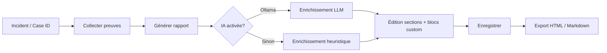

# Rapports d'investigation forensic

Génération de rapports d'incident complets depuis le portail CERT : collecte automatique des preuves, sections éditables, blocs personnalisés et enrichissement IA locale (Ollama ou heuristique).

## Accès portail

| Emplacement | Action |
|-------------|--------|
| Menu **Rapports forensic** | Générateur autonome (saisie `case_id`) |
| Menu **Incidents** → détail | Bouton **Générer le rapport** |
| Panneau **Incidents** (détail) | Section « Rapport forensic » + bouton |

Fichiers UI : `portal-shared/js/forensic-report.js`, `portal-shared/css/forensic-report.css`.

## Workflow analyste



1. Ouvrir un incident ou saisir le `case_id` (ex. `CASE-UC01-RANSOM`).
2. **Collecter les preuves** — agrégation OpenSearch sans créer de rapport.
3. Choisir un **modèle** (IR standard, note direction, technique approfondi).
4. **Générer le rapport** — option « Enrichir avec l'IA ».
5. Modifier les sections (markdown), ajouter des blocs libres (impact métier, communication, etc.).
6. Enrichir une section à la demande via **Enrichir (IA)**.
7. **Enregistrer** puis **Exporter** (HTML pour impression/PDF navigateur, Markdown pour archivage).

## Preuves collectées automatiquement

| Source | Contenu |
|--------|---------|
| `forensic-uploads*` | Fichiers déposés (CERT/IT), métadonnées MinIO |
| Indices `forensic-*` | Événements corrélés au `case_id` |
| `forensic-ti-*` | IOC et enrichissement threat intel |
| `forensic-alerts*` | Alertes corrélées |
| Incident master | Titre, sévérité, statut, assigné |

Agrégations : hôtes, IP sources, top `event.action`, volumétrie.

## Modèles de rapport

| ID | Sections incluses |
|----|-------------------|
| `standard-ir` | Synthèse, vue d'ensemble, chronologie, preuves, constats, IOC, recommandations |
| `executive-brief` | Synthèse, vue d'ensemble, recommandations |
| `technical-deep` | Vue d'ensemble, chronologie, preuves, constats, IOC, artefacts, recommandations |

## API REST

Base : `/api/reports` (authentification session requise).

| Méthode | Chemin | Description |
|---------|--------|-------------|
| GET | `/api/reports/templates` | Modèles disponibles |
| GET | `/api/reports/llm/status` | État Ollama / mode heuristique |
| GET | `/api/reports?case_id=` | Liste des rapports d'un cas |
| GET | `/api/reports/:id` | Rapport complet |
| POST | `/api/reports/collect` | Collecte preuves (`case_id` ou `incident_id`) |
| POST | `/api/reports/generate` | Génération + option `enrich_ai` |
| PUT | `/api/reports/:id` | Sauvegarde éditions |
| POST | `/api/reports/:id/enrich` | Enrichir une section (`section_key`) |
| GET | `/api/reports/:id/export?format=html\|md\|json` | Export |
| DELETE | `/api/reports/:id` | Suppression |

Index OpenSearch : `forensic-portal-reports`.

Fichiers backend :

- `portal-cert/lib/forensic-report-engine.js` — collecte et rendu
- `portal-cert/lib/forensic-report-llm.js` — Ollama + heuristique
- `portal-cert/routes/forensic-report-routes.js` — routes Express

### Exemple génération

```json
POST /api/reports/generate
{
  "case_id": "CASE-UC01-RANSOM",
  "incident_id": "fp-inc-001",
  "template_id": "standard-ir",
  "title": "Rapport ransomware — post-mortem",
  "enrich_ai": true,
  "language": "fr",
  "custom_blocks": [
    { "title": "Impact métier", "content": "Production arrêtée 4h…" }
  ]
}
```

## IA locale (Ollama)

Sans cloud externe. Variables d'environnement (portail CERT) :

| Variable | Défaut | Rôle |
|----------|--------|------|
| `OLLAMA_URL` | _(vide)_ | URL API Ollama, ex. `http://ollama:11434` |
| `OLLAMA_MODEL` | `llama3.2` | Modèle pour enrichissement |
| `OLLAMA_TIMEOUT_MS` | `120000` | Timeout génération |

Si `OLLAMA_URL` est absent, l'enrichissement utilise un **moteur heuristique** intégré (même philosophie que PortalAI) : synthèse factuelle à partir du JSON de preuves, sans hallucination volontaire.

### Activer Ollama (optionnel)

```yaml
# docker-compose.yml — service optionnel
ollama:
  image: ollama/ollama:latest
  container_name: forensic-ollama
  ports:
    - "11434:11434"
  volumes:
    - ollama-data:/root/.ollama
  networks:
    - forensic-net
```

Puis dans `.env` du portail CERT :

```
OLLAMA_URL=http://ollama:11434
OLLAMA_MODEL=llama3.2
```

Télécharger le modèle : `docker exec forensic-ollama ollama pull llama3.2`

## Personnalisation

- Chaque section générée est **éditable** (textarea markdown).
- **Blocs personnalisés** : titres et contenus libres (non issus de la collecte).
- Statuts : `draft`, `review`, `final`.
- Ré-enrichissement section par section sans écraser les autres.

## Bonnes pratiques

- Relire et valider tout contenu IA avant diffusion externe.
- Marquer `final` uniquement après relecture analyste + lead.
- Exporter HTML et archiver dans MinIO / GED selon procédure interne.
- Croiser le rapport avec Timesketch, TheHive et la KB portail.

## Voir aussi

- [IR.md](./IR.md) — gestion incidents
- [API.md](./API.md) — référence endpoints
- [FLOWS.md](./FLOWS.md) — workflows analyste
