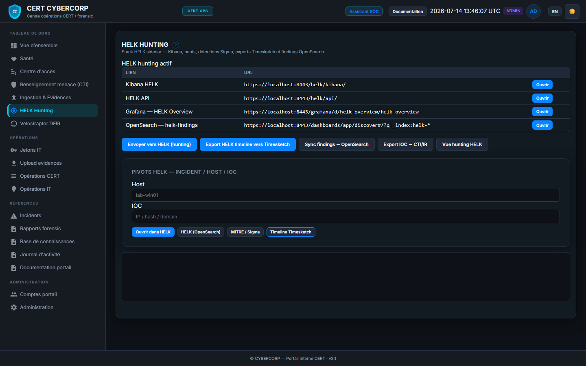
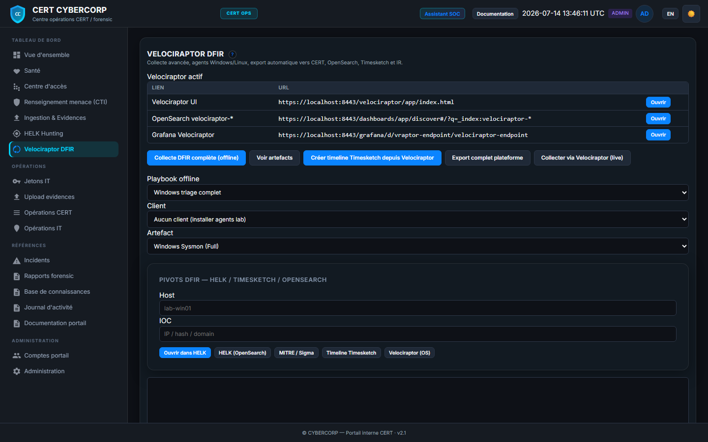
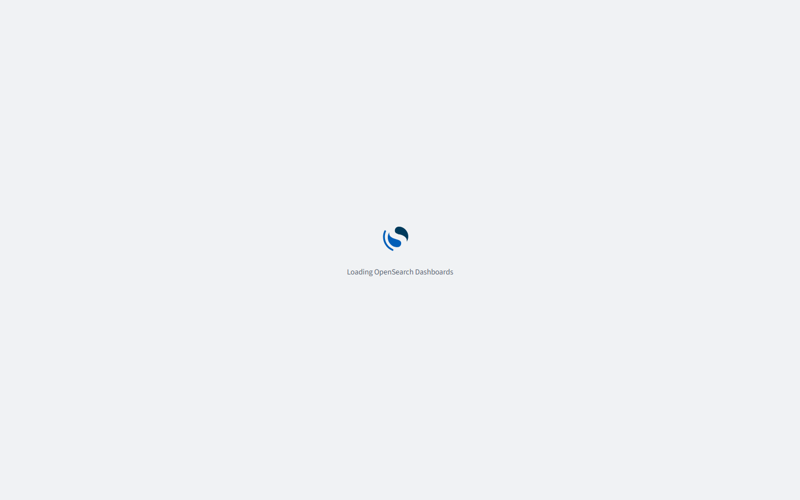
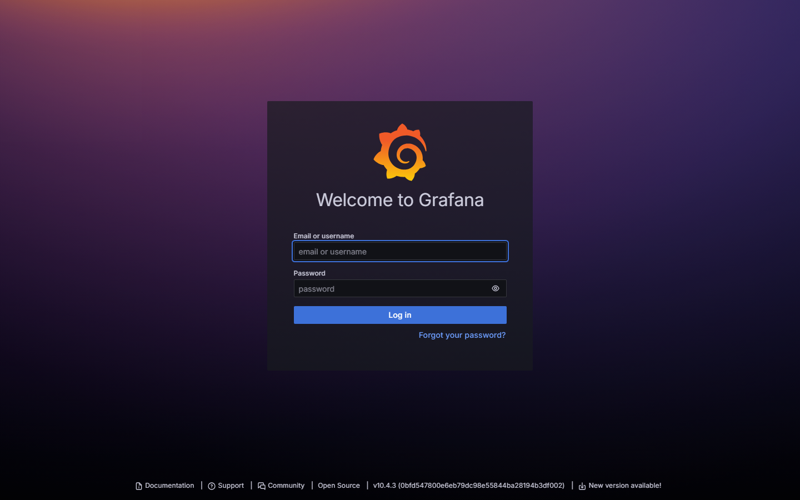
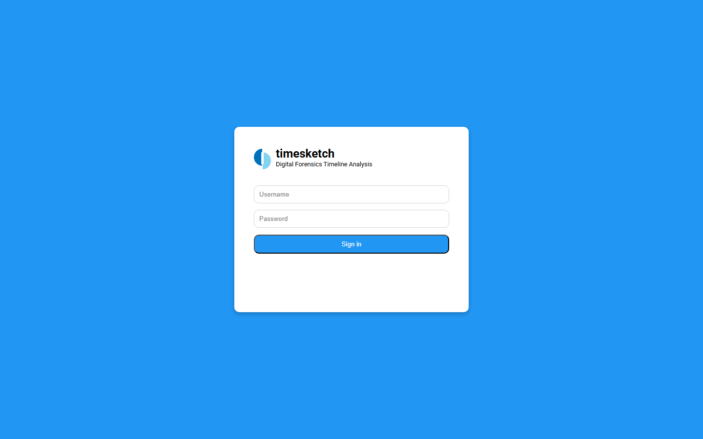
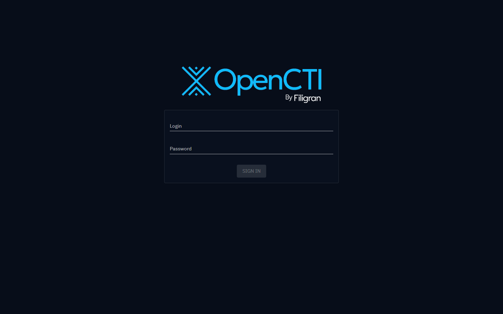
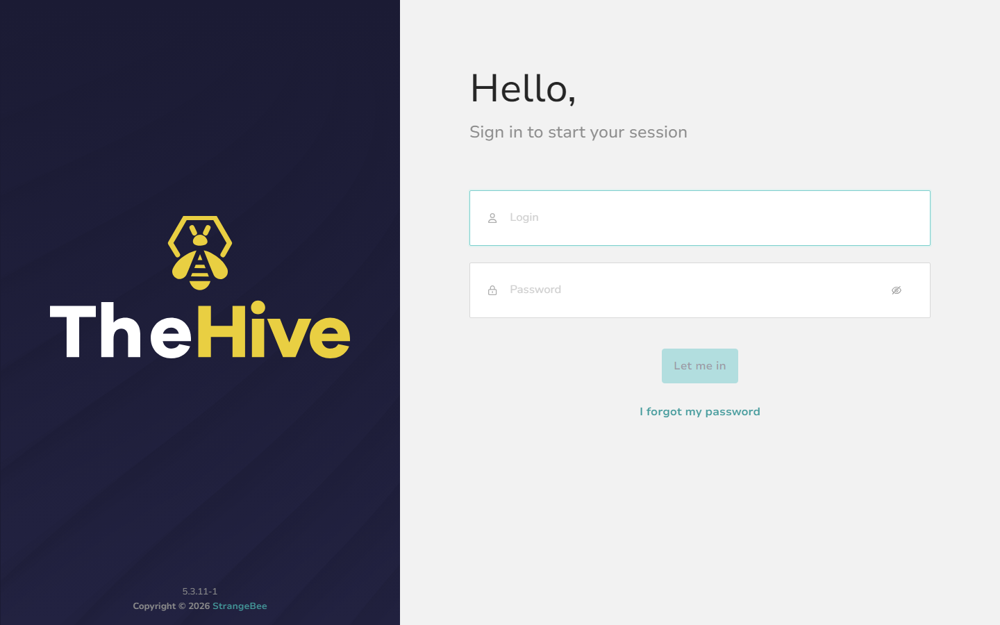
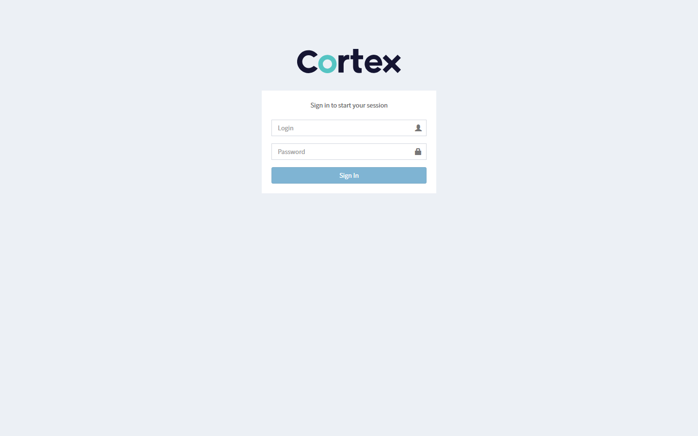
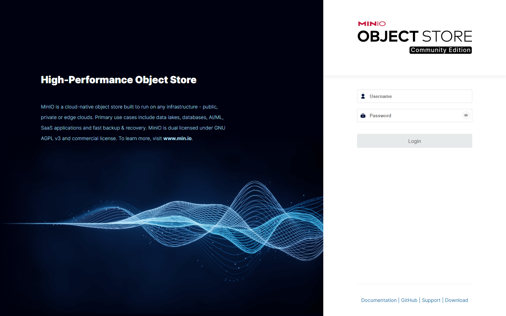

# Captures d'écran — portails CERT / IT & outils SOC

Galerie visuelle de référence pour la plateforme **forensic-minimal**. Les images sont régénérables à tout moment (voir [docs/images/README.md](../images/README.md)).

> **Viewport :** 1440×900 — thème sombre CYBERCORP par défaut.

---

## Portail CERT

Point d'entrée analyste : `https://<IP>/` (connexion `admin` + mot de passe portail).

| Vue | Description |
|-----|-------------|
| [Vue d'ensemble](../images/portals/cert-overview.png) | Cockpit SOC — KPI santé, ingest, CTI, raccourcis outils |
| [Santé](../images/portals/cert-health.png) | Monitoring 16 services, heatmap, logs |
| [Centre d'accès](../images/portals/cert-access-center.png) | URLs, identifiants outils par domaine (SIEM, DFIR, CTI…) |
| [Threat Intelligence](../images/portals/cert-threat-intel.png) | Hub CTI — IOC, connecteurs, volumétrie |
| [Ingestion & evidences](../images/portals/cert-ingest-evidence.png) | Pipeline ingest, uploads récents |
| [HELK Hunting](../images/portals/cert-helk-hunting.png) | Sidecar hunting — Kibana, hunts, détections Sigma |
| [Velociraptor DFIR](../images/portals/cert-velociraptor-dfir.png) | Collecte endpoint, agents, exports |
| [Jetons IT](../images/portals/cert-tokens.png) | Génération de liens de dépôt pour l'équipe IT |
| [Incidents](../images/portals/cert-incidents.png) | Liste + détail cas IR (FP-Master) |
| [Rapports forensic](../images/portals/cert-forensic-reports.png) | Rapports d'investigation exportables |

### Vue d'ensemble


### Centre d'accès


### HELK & Velociraptor





---

## Portail IT

Point d'entrée équipe IT : `https://<IP>/it/` — dépôt d'evidences via **token CERT**.

| Vue | Description |
|-----|-------------|
| [Dashboard](../images/portals/it-dashboard.png) | Synthèse IT, santé, pipeline ingest |
| [Santé](../images/portals/it-health.png) | État des services vus depuis le portail IT |
| [Upload (sans token)](../images/portals/it-upload.png) | Zone de dépôt — bannière token requis |
| [Upload (avec token)](../images/portals/it-upload-with-token.png) | Dépôt actif après génération token CERT |
| [Opérations](../images/portals/it-operations.png) | Journal opérations, filtres |

### Dashboard IT


### Upload avec token


---

## Outils SOC (via Nginx HTTPS)

Accès unifié sous `https://<IP>/…` — écrans de connexion / accueil.

| Outil | Capture |
|-------|---------|
| OpenSearch Dashboards |  |
| Grafana |  |
| Timesketch |  |
| OpenCTI |  |
| MISP |  |
| TheHive |  |
| Cortex |  |
| MinIO |  |
| HELK Kibana |  |
| Velociraptor GUI |  |

---

## Régénérer les captures

```bash
cd tests && npm install && npx playwright install chromium
cd ..
BASE_URL=https://<IP> node scripts/capture-portal-screenshots.mjs
```

Manifeste JSON : [`docs/images/manifest.json`](../images/manifest.json).

---

## Voir aussi

- [OVERVIEW.md](./OVERVIEW.md) — accès et rôles
- [MODULES.md](./MODULES.md) — cartographie fonctionnelle
- [FORENSIC-INVESTIGATION-GUIDE.md](./FORENSIC-INVESTIGATION-GUIDE.md) — parcours analyste + captures UC
