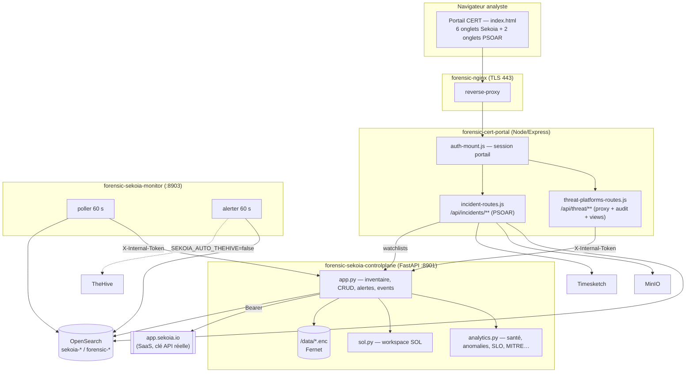
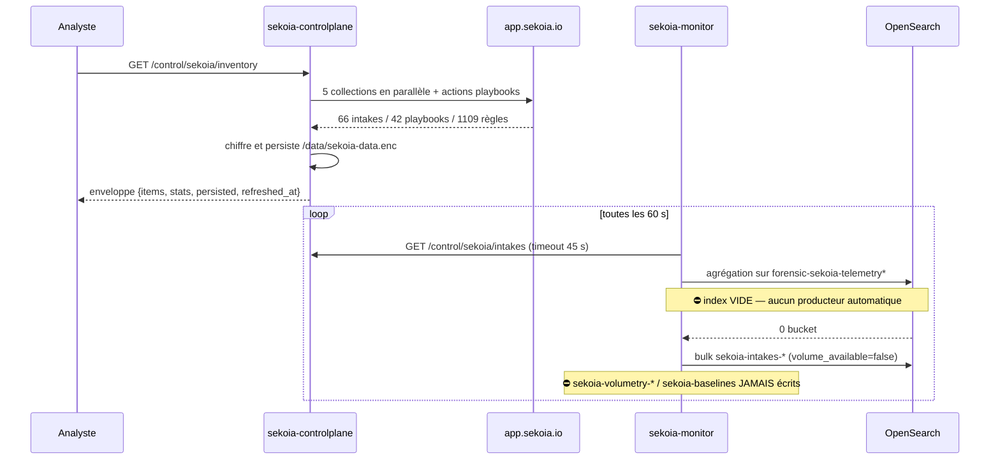

# 00 — AUDIT COMPLET SEKOIA + PSOAR (AS-IS)

**Plateforme** : Forensic Platform Max v1 — `/opt/forensic-plateform-max-v1`
**Dépôt** : https://github.com/waraperkin/forensic-plateform-max-v1
**Commit audité** : `e618ac8` (branche `main`, local == `origin/main`, 0 commit d'écart)
**Date d'audit** : 2026-07-30
**Auteur** : audit automatisé sur la plateforme *live* (VM Debian, 40+ conteneurs actifs)

> Ce document est le **gate de PHASE A**. Aucune ligne de refonte n'a été écrite avant sa rédaction.
> Toutes les affirmations ci-dessous sont adossées à une **preuve d'exécution** (commande + sortie),
> pas à une lecture de code seule. Aucun secret n'apparaît dans ce rapport.

---

## 1. Architecture AS-IS

### 1.1 Vue d'ensemble de la couche Sekoia + PSOAR



### 1.2 Flux de données Sekoia (et son point de rupture)



**C'est le défaut structurel central de la couche Sekoia** : toute la couche analytique
(volumétrie, baselines, anomalies z-score, SLO, prévisions, hosts intelligence, digest)
est construite sur un index — `forensic-sekoia-telemetry*` — qu'**aucun processus
n'alimente automatiquement**. Il n'est écrit que par un export manuel depuis l'onglet
« Fetch » (`POST /api/threat/export/opensearch` → `forensic-sekoia-telemetry-on-demand`).

---

## 2. Inventaire : fichiers, API, stores, conteneurs

### 2.1 Code

| Domaine | Fichier | Lignes | Rôle |
|---|---|---:|---|
| Sekoia backend | `connectors/sekoia-controlplane/app.py` | 1 518 | Inventaire, CRUD, alertes, events, config Fernet, purge |
| Sekoia backend | `connectors/sekoia-controlplane/analytics.py` | 723 | Santé, anomalies, SLO, forecast, MITRE, watchlists, snapshots, digest |
| Sekoia backend | `connectors/sekoia-controlplane/sol.py` | 394 | Workspace SOL (validation, run, bibliothèque) |
| Sekoia backend | tests `test_app/analytics/sol.py` | 1 068 | pytest (**non exécutables dans l'image**, cf. §3) |
| Sekoia monitor | `connectors/sekoia-monitor/monitor.py` | 443 | Poller volumétrie + moteur d'alertes |
| Portail proxy | `portal-cert/lib/threat-platforms-routes.js` | 353 | Proxy `/api/threat/**`, audit, views, dashboards, exports |
| PSOAR backend | `portal-cert/routes/incident-routes.js` | 650 | 15 routes : CRUD incidents, tâches, events, scan IOC, rapport, purge |
| Front Sekoia | `sekoia-control-center.js` | 2 386 | Console principale (monolithe, 104 fonctions) |
| Front Sekoia | `threat-platforms.js` | 1 771 | Vues intakes/rules/apikeys/fetch/config |
| Front Sekoia | `sekoia-volume.js` | 640 | Volumétrie |
| Front Sekoia | `cybercorp-hub.js` | 561 | Hub d'entrée |
| Front Sekoia | `sekoia-enterprise.js` / `-heatmap` / `-correlation` / `-ingest` | 810 | Vues satellites |
| Front PSOAR | `portal-shared/js/psoar.js` | 1 254 | File d'incidents + workspace |
| **Total front** | | **5 904** | |

### 2.2 Surface API

- **Control-plane Sekoia : 72 endpoints** (`app.py` 47, `analytics.py` 17, `sol.py` 6, `+2` health).
  Tous sous `/control/sekoia/*`, protégés par `X-Internal-Token`. `/health` ouvert (healthcheck Docker).
- **Portail CERT** : proxy catch-all `/api/threat/sekoia/*` avec allowlist regex (26 ressources)
  + 12 routes locales (audit, views, dashboards, apikey-tags, export Timesketch/OpenSearch).
- **PSOAR : 15 routes** sous `/api/incidents/**`, toutes derrière `requireAuth` (session portail).

### 2.3 Stores

| Store | Emplacement | Chiffrement | Purge |
|---|---|---|---|
| Secrets Sekoia | `/data/sekoia-secrets.enc` | Fernet | `DELETE /config` |
| Données Sekoia | `/data/sekoia-data.enc` | Fernet | `DELETE /config` + changement d'identité |
| Watchlists | `/data/sekoia-watchlists.json` | **clair** | conservées (donnée utilisateur) |
| Snapshots | `/data/sekoia-snapshots.json` | **clair** | purgées |
| Bibliothèque SOL | `/data/sekoia-sol-*.json` | **clair** | non purgée |
| Audit portail | `/shared-uploads/threat-audit.json` | clair, cap 5 000 | jamais |
| Views / dashboards / tags | `/shared-uploads/*.json` | clair | jamais |
| Incidents PSOAR | OpenSearch `forensic-incidents` | — | `DELETE /incidents/:id` |
| Events PSOAR | OpenSearch `forensic-incident-events` | — | idem |

### 2.4 Runtime observé

```
forensic-sekoia-controlplane   Up 6 h  (healthy)
forensic-sekoia-monitor        Up 8 h  (healthy)   ← healthy mais poll KO (cf. §3.2)
forensic-cert-portal           Up 7 h  (healthy)
forensic-nginx                 Up 7 h  (healthy)
```

`GET /api/health/global` → **16/16 services OK**, cluster OpenSearch `green`.

Tenant Sekoia **réel et joignable** :
```json
{"probe":{"ok":true,"status":"ok","http":200,"message":"Connexion OK (https://app.sekoia.io)."}}
{"has_api_key":true,"secrets_store":"encrypted-fernet",
 "data":{"persisted":true,"refreshed_at":"2026-07-30T19:45:58.000Z",
 "counts":{"intakes":66,"with_connector":5,"without_connector":61,"formats":31,
           "modules":17,"connectors":5,"playbooks":42,"rules":1109,"windows_intakes":16}}}
```

Indices OpenSearch pertinents :
```
sekoia-intakes-2026.07     18 282 docs   ✅ écrit
sekoia-alerts-2026.07         792 docs   ✅ écrit
sekoia-volumetry-*            ABSENT     ⛔
sekoia-baselines              ABSENT     ⛔
forensic-sekoia-telemetry*    ABSENT     ⛔
forensic-incidents                1 doc  (PSOAR quasi vierge)
forensic-linux-2026.07.30 1 472 234 docs (pipeline d'ingestion sain)
```

---

## 3. Forces, dettes et bugs — avec preuves

### 3.1 Forces réelles à préserver

- **F1 — Store Fernet robuste.** Dérivation SHA-256 si la clé n'est pas un Fernet valide
  (`app.py:108-125`) : le store reste utilisable et *stable entre redémarrages* quelle que
  soit la valeur du `.env`. Régression historique V01 correctement fermée. `secrets_store: ready`.
- **F2 — Persistance chiffrée + fallback.** `get_full()` conserve l'état précédent si un refresh
  échoue (`app.py:639-641`) et purge sur changement d'identité Sekoia (`app.py:749-752`). Vérifié :
  `persisted:true`, `refreshed_at` cohérent.
- **F3 — Masquage des secrets.** `_mask_secret()` (`app.py:381-389`) applique `abcd…90` sur
  `intake_key` **côté backend**, jamais côté vue. `intake_key_present` expose seulement un booléen.
  L'ancienne fuite d'`intake_key` est fermée.
- **F4 — Import circulaire résolu.** L'alias `sys.modules["app"]` (`app.py:43-44`) neutralise la
  double exécution quand `analytics.py`/`sol.py` font `import app` alors que `app.py` est `__main__`.
- **F5 — Dégradation propre du proxy.** `threat-platforms-routes.js:335-347` ne laisse **jamais**
  fuiter `ENOTFOUND` : message analyste en français + `error_code` technique séparé +
  `controlplane_unavailable:true`. Timeouts différenciés (120 s / 240 s pour `fetch|events|search`).
- **F6 — Clic sur la LIGNE déjà implémenté.** `psoar.js:38-52` (`delegate`) : un clic sur `tr` ou
  `.pso-rail-item` délègue au premier `[data-act]` de la ligne. **Exigence C2 déjà satisfaite** —
  à préserver strictement lors de la refonte du front.
- **F7 — i18n PSOAR complète.** 108 clés `T()` utilisées dans `psoar.js`, **0 manquante** en FR
  comme en EN (résolution `psoar.*` puis repli `sekoia.*`). 1 862 clés par langue, FR et EN au même
  compte — pas de divergence de fichiers.
- **F8 — Purge gouvernée PSOAR.** `dry_run` par défaut, `confirm:true` obligatoire, couverture
  OpenSearch + MinIO + Timesketch + audit (`incident-routes.js:570-645`).
- **F9 — Allowlist proxy + RBAC secrets.** Regex d'allowlist (`:300`) et écriture `/config`
  réservée au rôle `admin` (`:307-311`).

### 3.2 ⛔ B01 — La chaîne de volumétrie est morte (bug bloquant, P0)

**Preuve** — santé du monitor :
```json
{"status":"ok","last_poll_ok":false,"intakes_count":66,
 "errors":["poll:","poll:","poll:","poll:","poll:","poll:","poll:","poll:","poll:","poll:"]}
```
**Preuve** — logs :
```
poll: 66 intakes, 66 docs indexés, volumétrie_locale=False
WARNING poll_once:                      ← message d'exception VIDE
POST .../sekoia-volumetry-2026.07/_search "HTTP/1.1 404 Not Found"
```

Trois défauts distincts, imbriqués :

1. **Pas de producteur de télémétrie.** `monitor.py:53` agrège
   `SEKOIA_TELEMETRY_INDEX=forensic-sekoia-telemetry*`. Cet index n'existe pas : il n'est écrit
   que par l'export **manuel** de l'onglet Fetch. `fetch_volumetry()` retourne donc toujours `{}`,
   `update_baselines()` n'est jamais appelée (`monitor.py:219`), et
   `sekoia-volumetry-*` / `sekoia-baselines` ne sont jamais créés.
2. **Exception à message vide.** `poller_loop` (`monitor.py:280-283`) journalise `f"poll:{exc}"`.
   Or `httpx.ReadTimeout` a un `str()` vide → l'opérateur voit `"poll:"`, sans type ni cause.
   Le timeout de 45 s (`monitor.py:212`) est inférieur au temps de refresh complet du
   control-plane (66 intakes + 42 playbooks × actions + 1 109 règles). Avec `SEKOIA_CACHE_TTL=120`
   et un poll toutes les 60 s, **un poll sur deux** tombe sur un cache expiré et déclenche
   un refresh complet → timeout intermittent.
3. **Healthcheck menteur.** Le conteneur est `healthy` alors que `last_poll_ok:false` depuis
   des heures : `/health` retourne 200 sans considérer l'état fonctionnel.

**Impact en cascade — tout ce qui est vide ou faux dans l'UI :**

| Endpoint | Réponse live | Cause |
|---|---|---|
| `local/timeseries` | `{"available":false,...}` | B01 |
| `local/top-hostnames` | vide | B01 |
| `hosts/intelligence` | `available:false, total_hosts:0` | B01 |
| `forecast` | `available:false` | B01 |
| `digest` | `global_score:0.0, events_total:0` | B01 |
| `anomalies` | `available:true, count:0` (faux positif de disponibilité) | B01 |

### 3.3 ⛔ B02 — `slo` : OpenSearch HTTP 400 (P0)

```json
{"available":false,"error":"OpenSearch HTTP 400","hours":24,"target":99.0,"met":0,"total":0}
```
La requête SLO cible `sekoia-volumetry-*` (index inexistant) et/ou un champ non mappé. Le message
`OpenSearch HTTP 400` est opaque : `os_search()` (`app.py:1295-1305`) tronque la réponse et
**jette le corps de l'erreur**, rendant tout diagnostic impossible depuis l'UI.

### 3.4 ⛔ B03 — `effectiveness` : appel Sekoia invalide (P0)

```json
{"error":"HTTP 400: {\"code\":\"VA301\",\"message\":\"Request validation error\",
 \"context\":{\"querystring\":{\"limit\":[\"Must be greater than or equal to 1 and less than or equal to 100.\"]}}}",
 "total_alerts":0,"rules_with_alerts":0,"rules_silent":1109}
```
`analytics.py` demande les alertes avec un `limit` supérieur au maximum Sekoia (100) — probablement
`ALERTS_CAP=5000` passé tel quel. Conséquence métier grave : **les 1 109 règles sont déclarées
« silencieuses »** alors que le tenant compte 116 146 alertes (`digest.sekoia_alerts_total`).
L'indicateur d'efficacité affiché à l'analyste est donc **faux à 100 %**.

### 3.5 ⛔ B04 — `mitre-coverage` : extraction des techniques cassée (P1)

```json
{"rules_total":1109,"rules_with_mitre":76,"techniques_distinct":0,"tactics_covered":8,
 "matrix":[{"tactic":"reconnaissance","rules":3,"techniques":[],"techniques_count":0}, …]}
```
76 règles portent un marquage MITRE et 8 tactiques sont reconnues, mais **`techniques_distinct` = 0**
et toutes les listes `techniques` sont vides : le parsing des identifiants `Txxxx` échoue.
La matrice ATT&CK affichée est donc structurellement inexploitable (aucune technique, aucun gap réel).

**Deux causes distinctes, établies par inspection des données réelles :**

1. *Mauvaises clés scannées* (corrigé en P0). Le moteur lisait `payload` / `tags` / `description`
   alors que `build_detection_rules()` produit `rule_payload` / `rule_tags` / `rule_description`.
   Après correction : `rules_with_mitre` 76 → **216**, `tactics_covered` 8 → **12**.
2. *La donnée MITRE n'existe pas dans le catalogue récupéré* (**reste ouvert, à traiter en P1**).
   Inspection de règles réelles via `GET /rules?trim=0` :
   ```
   SentinelOne EDR Threat Detected — payload_len=161, Tcodes trouvés: []
   Elise Backdoor                  — payload_len=124, Tcodes trouvés: []
   champs disponibles liés : rule_tags uniquement ('Intelligence', 'SentinelOne EDR')
   ```
   L'endpoint `rules-catalog/multi-tenant/rules` ne renvoie **aucun identifiant `Txxxx`** :
   `payload` ne contient que la requête de détection (124–161 caractères), pas un document Sigma.
   **Conséquence : `techniques_distinct` restera à 0 quelle que soit la regex.** Les
   `tactics_covered: 12` ne sont qu'une **coïncidence lexicale** (le nom d'une tactique
   apparaissant dans un nom ou une description de règle) : la heatmap ATT&CK actuelle
   n'est pas seulement incomplète, elle est **dépourvue de sens**.
   *Correctif P1 requis* : enrichir depuis `GET /api/v1/sic/conf/rules/{uuid}` (champs
   `attack_patterns` / `related_object_refs`), avec mise en cache — 1 109 appels détail —
   et, à défaut de donnée, afficher explicitement « couverture MITRE indisponible »
   plutôt qu'une matrice trompeuse.

### 3.6 Dettes de conception

| # | Dette | Preuve / localisation | Sévérité |
|---|---|---|---|
| D01 | **Front éclaté en 9 fichiers** sans routeur ni état partagé ; `sekoia-control-center.js` = 2 386 l. / 104 fonctions. Navigation par onglets plats (6 entrées Sekoia + 2 PSOAR dans la sidebar), pas par mission analyste. | `index.html:71-88`, `portal-shared/js/` | Haute |
| D02 | **Aucun lazy-load.** Tous les `<script>` Sekoia chargés inconditionnellement dans `index.html` (~200 Ko de JS) même si l'analyste ne va jamais dans Sekoia. Le rendu de 1 109 règles se fait sans virtualisation. | `index.html:681-684` | Haute |
| D03 | **24 clés i18n manquantes** côté Sekoia (FR **et** EN) → le nom brut de la clé s'affiche : `sekoia-volume.js` 14, `sekoia-correlation.js` 7, `sekoia-enterprise.js` 1, `sekoia-heatmap.js` 1, `sekoia-control-center.js` 1. Ex. `sekoia.reco_drop`, `sekoia.exports_hint`, `sekoia.heatmap_hint`. | mesure par script | Moyenne |
| D04 | **Tests pytest non exécutables dans l'image de production** : `No module named pytest` dans `forensic-sekoia-controlplane`. 1 068 lignes de tests existent mais ne tournent nulle part en CI locale. | exécution live | Haute |
| D05 | **Stores analytics en clair** (`watchlists`, `snapshots`, bibliothèque SOL) alors que les données Sekoia sont chiffrées Fernet — incohérence de posture. La bibliothèque SOL n'est de plus **pas purgée** par `DELETE /config`. | `analytics.py:35-36`, `app.py:203-215` | Moyenne |
| D06 | **Pas de journal d'exécution des playbooks.** Les 42 playbooks Sekoia sont listés (`GET /playbooks` + actions) mais il n'existe **ni déclenchement, ni dry-run, ni historique**. | `app.py:824-828` | Haute |
| D07 | **Pont TheHive désactivé et unidirectionnel.** `SEKOIA_AUTO_THEHIVE=false`; le seul pont existant crée un case par alerte dans `monitor.py`, sans retour d'état ni mapping riche. Aucun pont OpenCTI/MISP depuis la couche Sekoia. | `.env`, `monitor.py` | Haute |
| D08 | **Audit trail partiel et non immuable.** `threat-audit.json` (fichier plat, cap 5 000, réécrit intégralement à chaque entrée) ne couvre que les écritures **proxifiées** ; les actions PSOAR passent par `auditAction()` (autre canal). Aucun chaînage/scellement. | `threat-platforms-routes.js:30-91` | Moyenne |
| D09 | **PSOAR : modèle plat.** Les tâches sont un tableau **embarqué dans le document incident** (cap 60), sans conditions, branches, approbations ni rollback. Pas de graphe d'entités, pas de collaboration (`@mentions`, handoff), pas de vues sauvegardées, pas de raccourcis clavier. | `incident-routes.js:44-67, 266-332` | Haute |
| D10 | **PSOAR : SLA non actif.** `sla_due` est calculé et affiché, mais **aucun timer ni escalade** ne s'exécute côté serveur : un dépassement n'engendre aucune notification ni changement d'état. | `incident-routes.js:46-51` | Moyenne |
| D11 | **PSOAR : pas de soft-delete.** `DELETE /incidents/:id` supprime définitivement le document et ses events. Aucune rétention, aucune corbeille — en contradiction avec l'exigence de purge industrielle. | `incident-routes.js:238-250` | Moyenne |
| D12 | **Scan IOC séquentiel non borné en temps.** Boucle `for` de 150 requêtes OpenSearch consécutives (`SCAN_IOC_CAP=150`) sans parallélisme ni budget de temps → risque de timeout HTTP côté portail. | `incident-routes.js:418-443` | Moyenne |
| D13 | **Rapport PSOAR Markdown uniquement**, généré en concaténation de chaînes dans la route. Pas de PDF, pas de séparation moteur/gabarit, alors qu'un `forensic-report-engine.js` (839 l.) existe déjà par ailleurs dans le portail. | `incident-routes.js:490-567` | Moyenne |
| D14 | **Valeurs par défaut de service périmées.** `SEKOIA_CONTROLPLANE_URL` a pour défaut `http://cybercorp-sekoia-controlplane:8081` dans le code (portail **et** PSOAR) alors que la réalité est `http://sekoia-controlplane:8901`. Ne casse rien tant que le `.env` est présent, mais c'est une bombe à retardement (c'est exactement la classe de panne `ENOTFOUND` de l'historique). | `threat-platforms-routes.js:18-19`, `incident-routes.js:36-37` | Moyenne |
| D15 | **Pas de simulateur what-if, pas de GitOps de config, pas de fusion/dédup d'alertes** — trois capacités demandées absentes de bout en bout. | — | Haute |

---

## 4. Matrice d'intégration

### 4.1 Sekoia ↔ plateforme

| Cible | Sens | État réel | Verdict |
|---|---|---|---|
| Portail CERT | Sekoia → UI | Proxy `/api/threat/sekoia/*`, allowlist, token interne | ✅ solide |
| OpenSearch | Sekoia → OS | `sekoia-intakes-*` ✅ / `sekoia-alerts-*` ✅ / `sekoia-volumetry-*` ⛔ / `sekoia-baselines` ⛔ | ⚠ moitié morte |
| OpenSearch | OS → Sekoia | agrégations analytics sur index absents | ⛔ B01/B02 |
| TheHive | Sekoia → TheHive | case par alerte, **désactivé** (`SEKOIA_AUTO_THEHIVE=false`), pas de retour | ⛔ à refondre |
| OpenCTI | — | **aucun pont** depuis la couche Sekoia | ⛔ absent |
| MISP | — | **aucun pont** depuis la couche Sekoia | ⛔ absent |
| Timesketch | Sekoia → TS | export CSV des events collectés (`/api/threat/export/timesketch`) | ✅ fonctionnel |
| Cortex | — | aucun lien | ⛔ absent |

### 4.2 PSOAR ↔ plateforme

| Cible | Sens | État réel | Verdict |
|---|---|---|---|
| OpenSearch | PSOAR ↔ OS | incidents, events, uploads, scan IOC sur 12 patterns `forensic-*` | ✅ fonctionnel |
| MinIO | PSOAR → MinIO | suppression d'objets à la purge | ✅ |
| Timesketch | PSOAR → TS | suppression du sketch `[FP] <case>` à la purge | ✅ |
| Sekoia | PSOAR → CP | **une seule** intégration : `GET /control/sekoia/watchlists` pour enrichir le scan IOC | ⚠ minimal |
| TheHive | — | **aucun lien** (champ `linked_cases` = simples chaînes libres, non résolues) | ⛔ absent |
| OpenCTI / MISP / Cortex | — | **aucun lien** — pas d'enrichissement d'IOC | ⛔ absent |
| Velociraptor | — | aucun lien depuis PSOAR (bridge existe pourtant : `forensic-velociraptor-bridge` healthy) | ⛔ absent |

**Constat de fond** : PSOAR est aujourd'hui un **gestionnaire de tickets avec scan IOC**, pas un SOAR.
Il ne pilote aucun outil de la plateforme, et la boucle détection → réponse → validation est absente.

---

## 5. Plan de refonte priorisé — critères d'acceptation mesurables

### P0 — Rendre vraie la donnée (sans quoi toute UI est un mensonge)

| ID | Action | Critère d'acceptation **mesurable** |
|---|---|---|
| P0-1 | **Producteur de télémétrie Sekoia continu** : le monitor collecte périodiquement les événements du tenant (jobs Sekoia bornés) et/ou consomme les alertes, et écrit un index de télémétrie réel. | `GET /control/sekoia/local/timeseries` → `available:true` avec ≥ 1 point ; `sekoia-volumetry-*` et `sekoia-baselines` **existent** dans `_cat/indices` avec `docs.count > 0`. |
| P0-2 | **Corriger `effectiveness`** : pagination des alertes avec `limit ≤ 100`. | `total_alerts > 0` et `rules_silent < 1109` ; plus aucune erreur `VA301` dans la réponse. |
| P0-3 | **Corriger `slo`** : requête sur un index existant, erreurs OpenSearch remontées avec leur corps. | `available:true` ou message d'erreur contenant la raison OpenSearch exacte (plus jamais `OpenSearch HTTP 400` seul). |
| P0-4 | **Corriger `mitre-coverage`** : extraction robuste des `Txxxx(.yyy)` depuis payload, tags et datasources. | `techniques_distinct > 0` et au moins une tactique avec `techniques_count > 0`. |
| P0-5 | **Fiabiliser le poller** : timeout aligné sur le refresh réel, backoff, exceptions typées (`type(exc).__name__` + `repr`), `/health` reflétant `last_poll_ok`. | `last_poll_ok:true` sur 10 cycles consécutifs ; `errors` vide ou messages **non vides et typés** ; healthcheck `unhealthy` si le poll échoue > 5 cycles. |
| P0-6 | **Exécutabilité des tests** : pytest disponible et vert. | `pytest -q` dans le conteneur → **0 échec**, ≥ 100 tests collectés. |

### P1 — Sekoia Command Fabric (backend + front)

| ID | Action | Critère d'acceptation |
|---|---|---|
| P1-1 | Backend modularisé (`config/`, `inventory/`, `detection/`, `analytics/`, `automation/`, `bridges/`, `audit/`) — plus de `app.py` de 1 518 lignes. | Aucun module > 500 lignes ; `pytest` toujours vert ; les 72 endpoints existants répondent à l'identique (test de non-régression d'enveloppe). |
| P1-2 | **Unified Telemetry Graph** : intakes ↔ connectors ↔ rules ↔ assets ↔ alerts navigables. | Endpoint graphe retournant nœuds+arêtes pour les 66 intakes / 1 109 règles ; drill-down UI en ≤ 3 clics depuis un intake vers ses règles. |
| P1-3 | **Detection Coverage Engine** (gaps + recommandations), **Alert Fusion & Dedup**, **What-if Simulator**, **SLO/Effectiveness**, **Config GitOps** (export/import chiffré), **Audit trail chaîné**. | Chaque moteur : endpoint testé + écran UI + mode dégradé explicite si donnée absente. Audit : chaînage par empreinte vérifiable. |
| P1-4 | **Playbook Orchestrator** : inventaire, dry-run, déclenchement, journal d'exécution persistant. | Un dry-run sur un des 42 playbooks retourne le plan sans effet de bord ; toute exécution laisse une entrée horodatée immuable. |
| P1-5 | **Bridges TheHive / OpenCTI / MISP** avec mapping riche et mode sandbox si clé absente. | Création d'un case TheHive depuis une alerte Sekoia vérifiable via l'API TheHive ; absence de clé → `mode:"sandbox"` explicite, jamais d'erreur brute. |
| P1-6 | Front unifié **Overview → Detect → Hunt → Respond → Govern → Configure**, lazy-load, virtualisation. | 1 seul point d'entrée ; JS Sekoia chargé **uniquement** à l'ouverture de la console ; table de 1 109 règles : premier rendu < 1 s, défilement fluide. |
| P1-7 | Zéro secret, zéro erreur brute, i18n complète. | 0 `intake_key` en clair dans toute réponse `/api/threat/**` (test automatisé) ; **0 clé i18n manquante** FR et EN (script de vérification en CI) ; aucun `ENOTFOUND`/`ECONN*` visible en UI. |

### P2 — PSOAR Autonomous Incident OS

| ID | Action | Critère d'acceptation |
|---|---|---|
| P2-1 | Modèle de données explicite et versionné (incidents, tâches, evidences, IOC, playbooks, timelines, SLA, assignations, journal) avec persistance OpenSearch + mappings déclarés. | Aucune perte après F5 **et** après `docker restart` du portail ; mappings créés au démarrage (idempotent). |
| P2-2 | **Playbook Engine NIST/SANS** : steps, conditions, branches, approbations, rollback. | Un playbook à branche conditionnelle s'exécute et journalise chaque décision ; rollback restaure l'état antérieur des tâches. |
| P2-3 | **Incident Graph Workspace**, **Evidence Locker**, **IOC War Room** (Cortex/MISP/OpenCTI), **Collaboration**, **SLA & Escalation** actifs, **Report Factory** (MD+PDF), **Purple-team Loop**, **purge gouvernée avec soft-delete/rétention**. | Chaque capacité : route testée + écran + preuve d'exécution E2E dans `03-VALIDATION.md`. Scan IOC parallélisé avec budget de temps : 150 IOC en < 15 s. |
| P2-4 | Front : file + workspace plein écran, **clic sur la LIGNE conservé**, raccourcis, filtres, vues sauvegardées. | Test Playwright : clic sur `<tr>` (hors bouton) ouvre le détail ; ≥ 5 raccourcis clavier documentés ; une vue sauvegardée survit au rechargement. |
| P2-5 | E2E complet création → investigation → playbook → rapport → clôture. | Parcours Playwright vert avec captures horodatées dans `screenshots/`. |

### P3 — Qualité & livraison

| ID | Critère d'acceptation |
|---|---|
| P3-1 | `GET /api/health/global` reste à **16/16 OK** après chaque rebuild. |
| P3-2 | Seuls `cert-portal`, `sekoia-controlplane`, `sekoia-monitor` (+ `nginx` si nécessaire) sont reconstruits. TheHive, Cortex, MISP, OpenCTI, Timesketch, OpenSearch Dashboards, HELK **jamais touchés**. |
| P3-3 | Aucun secret dans le diff (`git diff` scanné) ; les 32 fichiers déjà modifiés en runtime (dont `velociraptor/config/api.config.yaml`, qui **contient des clés**) restent **hors commit**. |
| P3-4 | Branche `feat/sekoia-psoar-command-fabric` poussée + PR ouverte vers `main`. Aucun merge ni force-push sur `main`. |

---

## 6. Risques de régression sur le reste de la plateforme

| # | Risque | Probabilité | Impact | Mitigation retenue |
|---|---|---|---|---|
| R1 | **Commit accidentel de secrets** : l'arbre de travail contient 32 fichiers modifiés en runtime, dont `velociraptor/config/api.config.yaml` et `.../server.config.yaml` (clés privées), `config/nginx/static/*` (IP publique). | Élevée | Critique | Commits par **chemins explicites** uniquement (`git add <fichier>`), jamais `git add -A` / `git commit -a`. Scan du diff avant chaque commit. |
| R2 | **Nouveau producteur de télémétrie → explosion de volume OpenSearch.** `forensic-linux-2026.07.30` fait déjà 856 Mo ; un poller non borné sur un tenant à 116 146 alertes peut saturer le cluster. | Élevée | Élevé | Plafonds durs (taille de page, nombre de cycles), ILM/rétention explicite sur les index `sekoia-*`, agrégats plutôt que documents bruts. |
| R3 | **Charge sur l'API Sekoia SaaS** (rate-limit / révocation de clé) si la collecte devient agressive. | Moyenne | Élevé | Intervalle configurable, backoff exponentiel, respect strict de `limit ≤ 100`, cache partagé entre monitor et control-plane. |
| R4 | **Rebuild du `cert-portal` casse des routes non-Sekoia** (`cti-routes`, `master-routes`, `forensic-report-routes`, uploads). Précédent réel : commit `e02b3c8` — un `COPY` manquant au Dockerfile avait mis le portail en crash-loop et fait échouer 10/12 validations. | Moyenne | Critique | Vérifier le Dockerfile après tout ajout de fichier ; smoke-test des routes non-Sekoia après chaque recreate ; `health/global` avant/après. |
| R5 | **Refonte du front casse le thème Cybercorp** partagé avec le portail IT (`portal-shared/`). | Moyenne | Moyen | Namespacing CSS strict des nouveaux composants ; ne pas modifier `cybercorp-theme.css` ; contrôle visuel du portail IT. |
| R6 | **Perte des données PSOAR existantes** lors du changement de modèle (`forensic-incidents` contient déjà 1 incident réel). | Moyenne | Élevé | Migration additive (champs nouveaux optionnels), pas de `delete index`, lecture tolérante aux documents à l'ancien format. |
| R7 | **Modification de `_mask_secret` ou de l'allowlist proxy réintroduit une fuite d'`intake_key`** (régression historique déjà corrigée une fois). | Faible | Critique | Test automatisé anti-régression : aucune réponse `/api/threat/**` ne doit contenir une valeur d'`intake_key` non masquée. |
| R8 | **Purge Sekoia élargie détruit des index voisins** : `LOCAL_INDICES_PURGE` utilise des jokers (`sekoia-*`). Un élargissement imprudent toucherait `forensic-*`. | Faible | Critique | Liste d'index **explicite et testée**, jamais de joker `forensic-*` ; dry-run obligatoire. |
| R9 | **Timeouts nginx** sur les nouveaux endpoints lourds (graphe, simulateur). | Moyenne | Moyen | Traitement asynchrone + pagination ; aligner les timeouts nginx/portail/control-plane. |

---

## 7. Conclusion du gate

La couche Sekoia possède des **fondations backend saines** (Fernet, persistance, masquage, proxy
tolérant aux pannes, tenant réel à 66 intakes / 1 109 règles / 42 playbooks) mais sa **couche
analytique est non fonctionnelle** : quatre moteurs sur six retournent des données vides ou fausses,
à cause d'une chaîne de volumétrie qui n'a **jamais** été alimentée (B01) et de trois bugs
d'intégration (B02, B03, B04). Le front est éclaté en 9 fichiers sans navigation par mission.

PSOAR est fonctionnel mais reste un **gestionnaire d'incidents**, pas un SOAR : aucune orchestration
réelle, aucun pilotage de TheHive / Cortex / MISP / OpenCTI / Velociraptor, un modèle de tâches plat
embarqué dans le document incident, un SLA passif et pas de soft-delete.

**Le gate de PHASE A est franchi.** La refonte peut commencer, en respectant l'ordre P0 → P1 → P2 → P3 :
**rendre la donnée vraie avant de construire l'UI qui la montre.**
