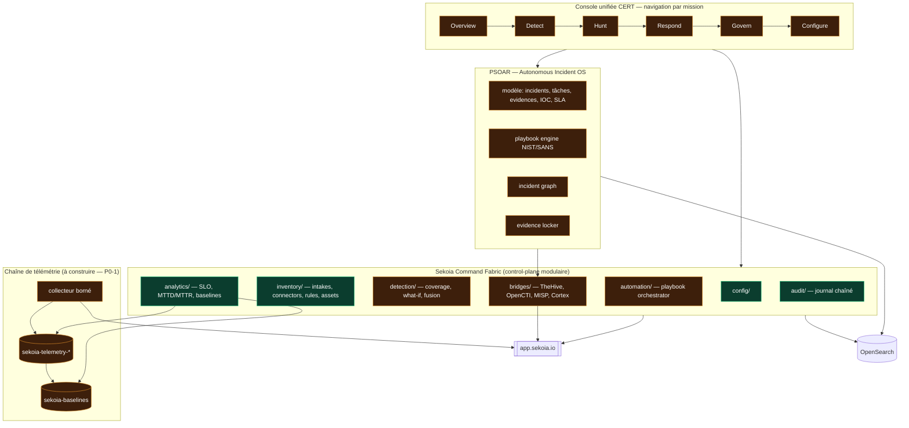

# 01 — ARCHITECTURE CIBLE

Ce document décrit l'architecture **visée** pour la couche Sekoia + PSOAR, et situe
précisément ce qui est **livré** par rapport à ce qui reste **à construire**.

---

## 1. Principe fondateur

> **La donnée doit être vraie avant l'écran qui l'affiche.**

L'audit a montré que la couche Sekoia disposait d'une UI riche posée sur quatre moteurs
retournant du vide ou du faux. Toute architecture cible part donc d'une règle
non négociable : **aucun écran ne publie un indicateur dont la source n'est pas
vérifiée**, et tout indicateur non calculable affiche explicitement *pourquoi*
plutôt qu'un zéro silencieux.

Cette règle est déjà appliquée dans `mitre-coverage`, qui sépare un signal de confiance
haute (`attack_patterns`) d'un signal de confiance basse (`lexical`) et retourne
`techniques.resolvable:false` avec son motif.

---

## 2. Architecture cible

**Vert** = fondations en place et vérifiées. **Orange** = à construire.

---

## 3. Décisions d'architecture prises

### D1 — Le catalogue de règles est celui du *tenant*, pas le catalogue global

`/api/v1/sic/conf/rules-catalog/rules` remplace `/rules-catalog/multi-tenant/rules`.

*Motif* : le second renvoie moins de règles (1 109 vs 1 180) et surtout **aucun**
`related_object_refs` — il privait le moteur de couverture de sa seule source
d'attack-patterns. Un repli sur l'ancien chemin est conservé pour les tenants
qui n'exposeraient pas le premier.

### D2 — Les alertes sont une source de référentiel, pas seulement un flux

Les alertes Sekoia portent `ttps` (attack-patterns nommés) et `time_to_*`
(MTTD/MTTR natifs). Elles sont donc traitées comme **source de données de référence** :
leur parcours alimente un dictionnaire UUID → libellé et les statistiques de cycle de vie.

*Conséquence de conception* : ce dictionnaire est actuellement un cache mémoire du
processus. Il doit être **persisté** (store Fernet, comme les autres données Sekoia)
pour survivre à un redémarrage — point ouvert.

### D3 — Les identifiants de corrélation restent en `text` + sous-champ `.keyword`

Plutôt que de redéclarer les champs en `keyword` pur — ce qui aurait imposé de
détruire ou réindexer `sekoia-intakes-*` et ses 18 282 documents d'historique —
les requêtes ciblent le sous-champ `.keyword` du mapping dynamique. Aucune perte
de données, convention uniforme sur tous les index `sekoia-*` présents et futurs.

### D4 — Un indicateur non calculable se déclare, il ne se tait pas

Tout moteur retourne `available`, et en cas d'indisponibilité un motif exploitable
(`techniques.reason`, `error` porteur de la cause OpenSearch réelle). Les états
dégradés sont une **fonctionnalité**, pas un cas d'erreur.

### D5 — La santé technique ne suffit pas, la santé fonctionnelle prime

`/health` du monitor reflète `poll_fail_streak`. Un conteneur qui répond mais ne
fait plus son travail doit apparaître **dégradé** : c'est ce healthcheck complaisant
qui a laissé la chaîne de volumétrie morte sans alerte.

---

## 4. Chantiers restants, par ordre d'engagement

### P0-1 — Producteur de télémétrie (bloquant pour 6 moteurs)

*Conception proposée* : collecteur borné dans `sekoia-monitor` — job de recherche
Sekoia sur fenêtre glissante, échantillon plafonné, agrégation locale par
`intake_uuid` × `log_hostname`, écriture d'**agrégats** (pas d'événements bruts)
dans `sekoia-telemetry-*`, drapeau `sampled:true` explicite.

*Arbitrage requis avant mise en œuvre* : plafond d'échantillonnage, intervalle de
collecte et politique de rétention — cela engage la charge sur l'API SaaS Sekoia
(risque R3) et le volume OpenSearch (risque R2, le cluster porte déjà 856 Mo sur
un seul index journalier).

### P1 — Sekoia Command Fabric

Découpage modulaire du control-plane (aucun module > 500 lignes), Unified Telemetry
Graph, Detection Coverage Engine, Alert Fusion & Dedup, What-if Simulator, Playbook
Orchestrator avec journal d'exécution, ponts TheHive/OpenCTI/MISP avec mode sandbox,
GitOps de configuration, audit chaîné. Front unifié Overview → Detect → Hunt →
Respond → Govern → Configure, avec lazy-load et virtualisation des tables.

### P2 — PSOAR Autonomous Incident OS

Modèle versionné avec mappings déclarés, moteur de playbooks NIST/SANS
(conditions, branches, approbations, rollback), graphe d'incident, evidence locker,
IOC war room branchée sur Cortex/MISP/OpenCTI, SLA actifs avec escalade,
report factory MD+PDF, purge gouvernée avec soft-delete et rétention.

**Contrainte non négociable reportée de l'existant** : le clic sur une **ligne** de
tableau ouvre le détail (`psoar.js`, fonction `delegate`). Comportement vérifié
en validation (contrôle V05) — à préserver dans toute refonte du front.
